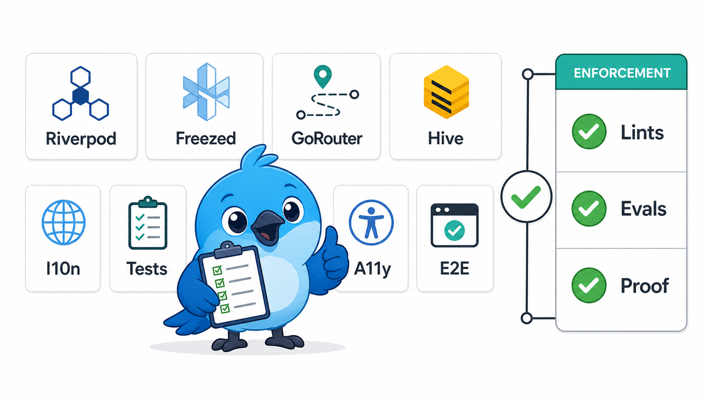

# Building Flutter Apps

> A strict Flutter architecture skill and plugin for teams that want Riverpod,
> Freezed, typed GoRouter, Hive CE, localization, tests, accessibility, and
> runtime proof enforced the same way every time.

<p align="center">
  
</p>

<p align="center">
  <a href="LICENSE"></a>
  <a href="https://flutter.dev"></a>
  <a href="https://riverpod.dev"></a>
</p>

This is not a generic Flutter tips repo. It is an opinionated policy package for
building Flutter apps with one clear architecture and enough local enforcement
that an agent cannot quietly drift into weaker patterns.

It is unofficial. It is not affiliated with Google, Flutter, Dart, Riverpod, or
their maintainers.

## What It Enforces

The target app shape is simple:

```text
UI widgets
  -> generated Riverpod providers and notifiers
  -> repositories
  -> local or remote datasources
  -> APIs, Hive boxes, platform plugins

Domain entities stay pure Dart.
Navigation goes through typed GoRouter routes.
User-facing copy goes through gen-l10n.
Behavior is proven with tests, lints, hooks, evals, and E2E evidence.
```

The main rules:

- Providers are generated with `@riverpod` / `@Riverpod`; manual provider
  constructors are out.
- State and domain models use sealed Freezed classes; hand-written immutable
  patterns are out.
- Widgets render and dispatch only. Business logic, storage, networking, and
  policy live behind their owning provider, notifier, repository, datasource, or
  service.
- Async work is guarded with `ref.mounted` or `context.mounted`.
- Domain primitives with meaning become Value Objects.
- Route strings are owned by typed GoRouter definitions and generated helpers.
- Visible strings, tooltips, and semantic labels come from `AppLocalizations`.
- Shared/realtime flows need writer plus observer proof, not screenshots.

## Why This Is Opinionated

Flutter lets teams build the same feature many ways. That flexibility is useful
for experiments, but it is expensive when agents are writing production code:
each extra acceptable pattern becomes another place for drift, hidden state, weak
tests, or shallow wrappers.

This architecture chooses one path on purpose. It is better for this workflow
because it makes ownership obvious:

| Common drift | This architecture forces |
|---|---|
| Widgets reaching into storage, HTTP, or plugins. | Widgets render localized UI and dispatch user intent only. |
| Notifiers mixing state transitions with SDK details. | Notifiers own state; repositories and datasources own IO boundaries. |
| Domain models shaped by JSON, Hive, or Flutter widgets. | Domain stays pure Dart with explicit Value Objects and invariants. |
| Route strings copied through the app. | Typed GoRouter routes are the navigation source of truth. |
| "Looks fine" UI changes without proof. | Lints, hooks, tests, accessibility checks, evals, and E2E proof all matter. |

The tradeoff is deliberate: less framework freedom, more repeatability. The goal
is not to cover every valid Flutter style. The goal is to make one strict style
easy to review, easy to test, and hard for an agent to accidentally weaken.

## How Enforcement Works

Install it as a plugin when you want enforcement. A raw `SKILL.md` install is
guidance-only and cannot register runtime hooks.

| Layer | What it does | Source |
|---|---|---|
| Skill | Loads the rules, trigger map, and pre-flight checklist into the agent context. | [SKILL.md](skills/building-flutter-apps/SKILL.md) |
| Hooks | Blocks obvious drift after edits and before the agent stops. | [hooks/](hooks/) |
| Analyzer | Enforces AST-level Flutter/Riverpod rules through `dart analyze`. | [analysis_options.yaml](skills/building-flutter-apps/references/analysis_options.yaml) |
| Evals | Checks trigger behavior and answer quality with `gpt-5.4-mini`. | [evals/](evals/) |
| References | Holds detailed guidance so `SKILL.md` stays small and direct. | [references/](skills/building-flutter-apps/references/) |

The hard project gate is still package-root `dart analyze` with
`flutter_skill_lints` and `riverpod_lint` wired under top-level `plugins:` in
`analysis_options.yaml`.

## Enforcement Coverage

The README is intentionally short, so it does not list every rule. The full
contract lives in [SKILL.md](skills/building-flutter-apps/SKILL.md) and the task-specific files under
[references/](skills/building-flutter-apps/references/). In practice, the enforcement covers more than folder
layout:

| Area | What gets enforced |
|---|---|
| Analyzer setup | `analysis_options.yaml` exists, strict analyzer flags stay on, generated files are excluded, and both `flutter_skill_lints` and `riverpod_lint` are proven active. |
| Riverpod | Generated providers only, no legacy provider constructors, no `ref.watch` in notifier methods, no provider-derived caches in `ConsumerState`, and no standalone event/signal providers. |
| Async lifecycle | `ref.mounted` / `context.mounted` guards after awaits, safe `finally` handling, cancelled subscriptions/timers/controllers, and stale async write protection. |
| Widgets | No `_buildXxx()` helpers, no private widget classes except private `State<T>`, no widget-owned infra dependencies, no mutation result branching, and no raw snackbar dispatch from widgets. |
| State and domain | Sealed Freezed classes, semantic nullability, no sentinel fallbacks, Value Objects for meaningful primitives, pure domain imports, and no hand-written domain `copyWith`. |
| Storage and IO | Hive, SharedPreferences, secure storage, file APIs, and path-provider calls stay in local datasources, then flow through repositories. |
| Navigation | Typed GoRouter helpers own page navigation, raw route strings and named navigation are blocked, redirects are pure and matrix-tested, and modal helpers keep local dismissal separate. |
| Localization and accessibility | User-facing copy, tooltips, semantic labels, image labels, and accessibility text come from l10n; app-root text-scale clamps are blocked. |
| Performance and interaction | High-frequency inputs debounce/throttle/coalesce, expensive widgets are gated, repeated lookups use shared indexes/extensions, and broad collection watches are avoided. |
| Platform APIs | Exact-alarm permission uses `flutter_local_notifications`; platform-specific plugin implementations are resolved and null-checked before use. |
| Previews and E2E | Widget previews use deterministic fakes only; runtime E2E proves behavior with stable selectors, logs, cleanup, and writer-plus-observer proof for shared state. |
| Repo drift | Drift checks keep docs/examples honest, smoke tests exercise hook fixtures, markdown examples are parsed, and `gpt-5.4-mini` evals cover trigger and answer quality. |

## Architecture

```text
lib/
├── core/
│   ├── extensions/
│   ├── navigation/
│   ├── services/
│   ├── theme/
│   └── widgets/
├── features/
│   └── feature_x/
│       ├── data/           # DTOs, models, local/remote datasources
│       ├── domain/         # Pure Dart entities and value objects
│       ├── repositories/   # Orchestration and model/entity mapping
│       └── presentation/   # Notifiers, screens, atoms, widgets
└── main.dart
```

Ownership rules are the point:

| Owner | Belongs here | Does not belong here |
|---|---|---|
| Widget | Layout, localized rendering, user dispatch. | Storage, HTTP, mutation policy, provider-derived caches. |
| Notifier | State transitions, mutation flow, durable UI status. | Hive calls, plugin calls, raw HTTP, hidden dependency construction. |
| Repository | Domain-facing contract and orchestration. | UI state, BuildContext, widget concerns. |
| Datasource | API/Hive/platform details and wire models. | Domain policy or presentation decisions. |
| Domain | Pure entities, Value Objects, invariants. | Flutter imports, JSON, Hive annotations, UI copy. |

## Install

### Standalone agent skill

```bash
npx skills add https://github.com/sgaabdu4/building-flutter-apps --skill building-flutter-apps
```

Codex can invoke it explicitly with `$building-flutter-apps`; other harnesses
use their own skill-selection syntax.

### Claude Code

```bash
/plugin marketplace add sgaabdu4/building-flutter-apps
/plugin install building-flutter-apps@building-flutter-apps
```

Claude reads `.claude-plugin/marketplace.json` and
`.claude-plugin/plugin.json`, then loads `hooks/hooks.json`.
Invoke the skill explicitly with `/building-flutter-apps:building-flutter-apps`;
Claude may also select it automatically from its description.

### Codex CLI

```bash
codex plugin marketplace add sgaabdu4/building-flutter-apps --ref master
codex plugin add building-flutter-apps@building-flutter-apps
```

Codex reads `.codex-plugin/plugin.json`, loads the shared skill, and discovers
`hooks/hooks.json`. Review and trust the hook definition in `/hooks`, then start
a new task.

### Copilot CLI

```bash
copilot plugin marketplace add sgaabdu4/building-flutter-apps
copilot plugin install building-flutter-apps@building-flutter-apps
```

Copilot reads `.github/plugin/marketplace.json` and root `plugin.json`, then
loads `hooks/hooks.copilot.json`.

## Bootstrap A Flutter Project

```bash
cp <plugin-cache>/skills/building-flutter-apps/references/analysis_options.yaml ./analysis_options.yaml
mkdir -p lib/core/extensions
cp <plugin-cache>/skills/building-flutter-apps/templates/flutter/lib/core/extensions/*.dart ./lib/core/extensions/
dart pub get
dart analyze
```

Notes:

- `flutter_skill_lints` is an analyzer plugin. Keep it only in
  `analysis_options.yaml` under `plugins:`; do not add it to `pubspec.yaml`.
- If `lib/core/extensions/` already exists, merge the template files instead of
  overwriting them.
- A healthy setup should prove that at least one `flutter_skill_lints`
  diagnostic and one `riverpod_lint` diagnostic can fire.

## What's Included

### Core Stack

The installed skill owns the exact package constraints in
[core-stack.md](skills/building-flutter-apps/references/core-stack.md), so the
same source of truth is available to every supported agent harness. Constraint
changes require a real project package solve and analyzer proof.

### Hook Events

| Runtime | Edit hook | Stop hook | Prompt hook |
|---|---|---|---|
| Claude Code | `PostToolUse` | `Stop` | `UserPromptSubmit` |
| Codex CLI | `PostToolUse` | `Stop` | `UserPromptSubmit` |
| Copilot CLI | `postToolUse` | `agentStop` | `userPromptSubmitted` |

The hook scripts no-op outside Flutter projects by walking upward for
`pubspec.yaml`.

### Reference Guide

| Topic | File |
|---|---|
| Architecture and layers | [references/architecture.md](skills/building-flutter-apps/references/architecture.md) |
| Analyzer setup | [references/analysis-options.md](skills/building-flutter-apps/references/analysis-options.md) |
| Atomic UI and accessibility | [references/atomic-design.md](skills/building-flutter-apps/references/atomic-design.md) |
| Riverpod codegen | [references/riverpod-codegen.md](skills/building-flutter-apps/references/riverpod-codegen.md) |
| Freezed and sealed state | [references/freezed-sealed.md](skills/building-flutter-apps/references/freezed-sealed.md) |
| State lifecycle | [references/state-management-lifecycle.md](skills/building-flutter-apps/references/state-management-lifecycle.md) |
| Testing | [references/testing.md](skills/building-flutter-apps/references/testing.md) |
| Networking boundaries | [references/networking.md](skills/building-flutter-apps/references/networking.md) |
| l10n and ARB files | [references/localization.md](skills/building-flutter-apps/references/localization.md) |
| Typed routing and deep links | [references/deep-linking.md](skills/building-flutter-apps/references/deep-linking.md) |
| Common patterns | [references/common-patterns.md](skills/building-flutter-apps/references/common-patterns.md) |
| Hive CE persistence | [references/hive-persistence.md](skills/building-flutter-apps/references/hive-persistence.md) |
| Widget previews | [references/widget-previews.md](skills/building-flutter-apps/references/widget-previews.md) |
| Runtime E2E proof | [references/dart-mcp-e2e-testing.md](skills/building-flutter-apps/references/dart-mcp-e2e-testing.md) |

## Evals And Proof

The eval harnesses are deliberately split:

| File | Purpose |
|---|---|
| [evals/trigger-eval.json](evals/trigger-eval.json) | Checks when the skill should and should not activate. |
| [evals/evals.json](evals/evals.json) | Checks whether answers follow the policy. |
| [evals/results/](evals/results/) | Stores compact `gpt-5.4-mini` proof artifacts. |
| [evals/gpt-5.4-mini-eval-decisions.md](evals/gpt-5.4-mini-eval-decisions.md) | Records eval decisions, tradeoffs, and proof. |

Run the local structural checks before publishing changes:

```bash
bash tool/check_drift.sh
bash tool/smoke_test.sh
ruby tool/verify_markdown_examples.rb
```

## Code Generation

Use the long flag in documentation and automation:

```bash
dart run build_runner watch --delete-conflicting-outputs
dart run build_runner build --delete-conflicting-outputs
dart run build_runner clean && dart run build_runner build --delete-conflicting-outputs
```

## Upstream Drift

This repo tracks the upstream `flutter/skills` Flutter skill set by commit and
per-skill hash in [tool/upstream/flutter_skills.lock.json](tool/upstream/flutter_skills.lock.json).

```bash
ruby tool/check_upstream_flutter_skills.rb
ruby tool/check_upstream_flutter_skills.rb --update
```

Use `--strict-commit` when CI should fail on upstream commits even if tracked
Flutter skill files did not change.

## Contributing

Keep changes small and enforceable:

- Put detailed guidance in `skills/building-flutter-apps/references/`, not in `SKILL.md`.
- Keep `skills/building-flutter-apps/references/core-stack.md` as the package-version SSOT.
- Add or update hook fixtures when changing scanner behavior.
- Add eval cases when changing trigger behavior or answer policy.
- Run drift, smoke, markdown-example, and relevant eval checks before release.

## License

MIT. See [LICENSE](LICENSE).
