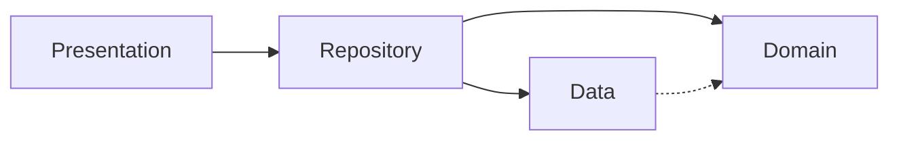
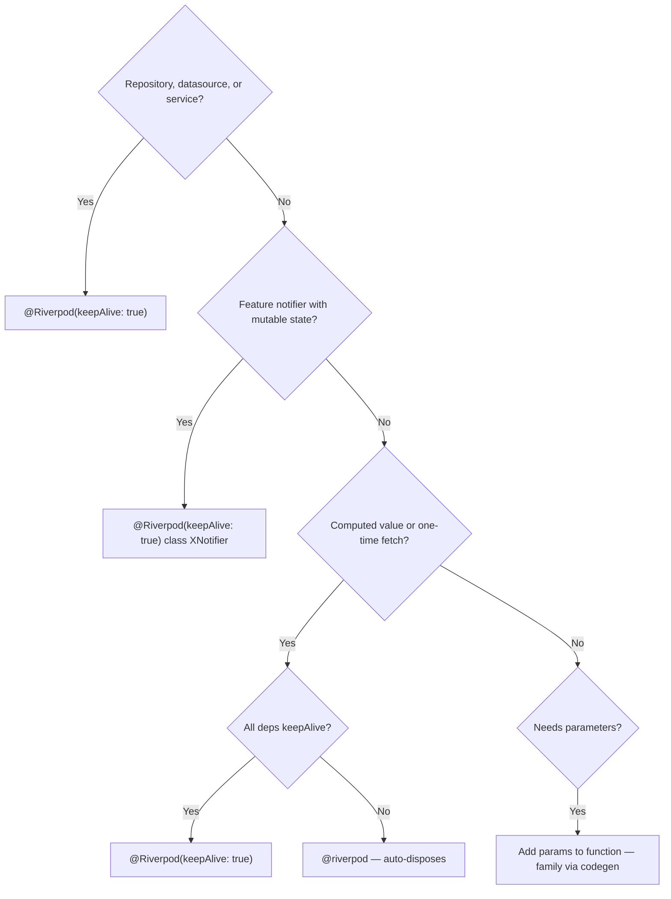

# Flutter Best Practices

## MANDATORY — Read Before Writing Any Code

**You MUST follow every rule in this skill. No exceptions. No shortcuts.**

1. **MUST read [architecture.md](references/architecture.md) BEFORE creating any feature module, entity, model, datasource, or repository.** It contains required code patterns with interface contracts, layer separation, and directory structure.
2. **MUST read [freezed-sealed.md](references/freezed-sealed.md) BEFORE creating any Freezed class.** It contains required sealed class patterns, JSON serialization, and build.yaml configuration.
3. **MUST read [state-management.md](references/state-management.md) BEFORE creating any notifier.** It contains required async patterns, error handling, and cross-provider communication.
4. **NEVER generate code that violates the Critical Rules below.** If unsure, re-read the relevant reference file.
5. **NEVER use `dynamic`, helper methods (`_buildXxx`), hardcoded strings, or `shrinkWrap: true`.**
6. **ALWAYS define `abstract interface class` for every repository and datasource.**
7. **ALWAYS check `if (!ref.mounted) return;` after every `await` in notifiers.**
8. **ALWAYS use `sealed class` with Freezed — NEVER `abstract class`.**
9. **ALWAYS use `ref.watch()` in `build()` for reactive state. `ref.read()` ONLY in callbacks.**
10. **NEVER prop drill.** Child widgets MUST watch providers directly.

## Core Stack

| Package | Purpose |
|---------|----------|
| flutter_riverpod + riverpod_annotation + riverpod_generator | State management (codegen) |
| freezed + freezed_annotation | Immutable data classes, unions |
| go_router + go_router_builder | Declarative, type-safe routing |
| json_serializable + build_runner | JSON serialization + code generation |
| showcaseview | First-run guided tours |
| hive_ce + hive_ce_flutter | Local persistence |

## Architecture



Four layers. Dependencies flow inward. Each layer has one job:

| Layer | Contains | Rule |
|-------|----------|------|
| Domain | Entities (pure Dart, no deps) | No `fromJson`/`toJson`, no Flutter imports |
| Data | Models + Datasources | Models own `toEntity()`, datasources handle API/local |
| Repository | Orchestration | Bridges Data→Domain, maps models→entities |
| Presentation | Notifiers + Screens + Widgets | Manages state and UI |

```
lib/
├── core/           # Shared: theme, utils, widgets, navigation, services
├── features/
│   └── feature_x/
│       ├── data/           # Models, datasources (API/local)
│       ├── domain/         # Entities (pure Dart, no dependencies)
│       ├── repositories/   # Orchestrate data sources, map models → entities
│       └── presentation/   # Notifiers, screens, widgets
└── main.dart
```

**ALWAYS create separate data models and domain entities** — repositories call `model.toEntity()` to convert.

## Critical Rules

1. **Codegen only** — MUST use `@riverpod` / `@Riverpod(keepAlive: true)`. NEVER use legacy `StateProvider`, `StateNotifierProvider`, etc.
2. **Sealed classes** — MUST use `sealed class` with Freezed. NEVER use `abstract class`. Dart's `sealed` enables exhaustive `switch`.
3. **No prop drilling** — Child widgets MUST watch providers directly. NEVER pass state through constructors.
4. **Guard async** — MUST check `if (!ref.mounted) return;` after EVERY `await` in notifiers. MUST check `if (!context.mounted) return;` after EVERY `await` in widgets.
5. **Single Ref** — Riverpod 3.0 unified all Ref types. NEVER use `AutoDisposeRef`, `FutureProviderRef`, `ExampleRef`.
6. **Equality filtering** — Providers use `==` to skip redundant notifications.
7. **Select in leaves** — MUST use `ref.watch(provider.select((s) => s.field))` in leaf widgets.
8. **One primary class per file** — Exception: Freezed state + its notifier may share a file when tightly coupled and small.
9. **Interface contracts** — MUST define `abstract interface class` for every repository and datasource. Interface lives in the same file, directly above the implementation. Constructors MUST accept interfaces, NEVER concrete types.
10. **No `dynamic`** — NEVER use `dynamic` as a type. Use `Object?` or a proper type. Exception: `Map<String, dynamic>` in `fromJson`/`toJson`.
11. **Widget classes only** — NEVER use helper methods like `_buildIcon()`, `_buildContent()`. Extract to separate widget classes. Use `@visibleForTesting` for test-only widgets, not underscore prefix.
12. **No hardcoded strings** — MUST use `*Strings` constants classes for all user-facing text with `static const`.
13. **ref.watch in build, ref.read in callbacks** — MUST use `ref.watch()` for reactive state in `build()`. Use `ref.read()` ONLY for notifier access in callbacks.
14. **Provider naming** — Riverpod 3.x codegen strips "Notifier" suffix: `FooNotifier` → `fooProvider` (NOT `fooNotifierProvider`).
15. **No `shrinkWrap: true`** — NEVER use `shrinkWrap: true` on `ListView`/`GridView` — defeats lazy loading. Use `Sliver` variants or constrained containers.
16. **Mixins for capabilities, interfaces for contracts** — MUST use `mixin` to share behavior across unrelated classes. MUST use `abstract interface class` for dependency injection contracts. NEVER use inheritance for cross-cutting capabilities. See [mixins.md](references/mixins.md).
17. **No null-bang (`!`)** — Never `value!`. Use `if (value case final v?)` to null-check and bind.
18. **`abstract final class` for static-only namespaces** — Never `Class._()`. Use `abstract final class`: compiler blocks construction, extension, and implementation. Exception: `const Entity._()` in Freezed classes — required for getters/methods.

## Provider Decision Tree



## Anti-Patterns

| Wrong | Right | Why |
|-------|-------|-----|
| `StateProvider` | `@riverpod` codegen | Legacy, moved to `legacy.dart` |
| `abstract class` with Freezed | `sealed class` | Enables exhaustive matching |
| Parent watches, passes to child | Child watches directly | Prop drilling |
| Missing `ref.mounted` check | `if (!ref.mounted) return;` | Crash on disposed notifier |
| Auto-dispose on all-keepAlive dep chain | `@Riverpod(keepAlive: true)` | Breaks pause/resume lifecycle |
| Try-catch at every layer | Catch once in notifier | Useless rethrows |
| `context.go('/path')` string routes | `const MyRoute().go(context)` typed | No compile-time safety |
| Entity directly in datasources | Data `Model` with `toEntity()` in repo | Domain stays pure |
| Per-class `@JsonSerializable(explicitToJson: true)` | `explicit_to_json: true` in `build.yaml` | One global config |
| `@Freezed(toJson: true)` when `fromJson` exists | Plain `@freezed` | Auto-generates `toJson` when `fromJson` uses `=>` |
| Concrete repo/datasource in constructor | Depend on `abstract interface class` | Tight coupling, untestable |
| `dynamic` as a type | `Object?` or a proper type | Disables static analysis |
| Anemic model + extraction in repo | Rich Model with methods on the model | Keep behavior with data |
| Using `context` after `await` | `if (!context.mounted) return;` | Context may be invalid after async gap |
| Helper methods `_buildXxx()` | Extract to widget classes | Untestable, violates composition |
| `ref.read` in `initState` | `addPostFrameCallback` then read | Provider not ready |
| Raw `Map`/`List` as `.family` param | Use Freezed object or primitives | `==` fails on collections, breaks caching |
| Provider for ephemeral local state | `StatefulWidget` local state | Providers are for shared/cross-widget state |
| Omitting fields in remote data object | Include every schema field in push | Silent default overwrites remote value |
| Inheritance to share behavior across unrelated classes | `mixin` with `with` keyword | Creates false "is-a" hierarchies |
| Mixin with mutable state fields | Stateless mixin — pass services as args | Hidden side effects across classes |
| `mixin class` by default | Pure `mixin` unless also instantiated | Unnecessary coupling |
| Mixin to add methods to types you don't own | `extension on Type` | Mixins need `with`; extensions are transparent |
| `ServiceFactory` / `ServiceLocator` for SDK clients | Direct `@Riverpod(keepAlive: true)` providers | Providers ARE the DI — no wrapper needed |
| `value!` null-bang operator | `if (value case final v?)` | Runtime crash; `case final` is compile-time safe |
| `class Foo { Foo._(); }` | `abstract final class Foo` | Compiler-enforced; `._()` is bypassable in same library |

Full anti-patterns including router, sync, and utility patterns: [common-patterns.md](references/common-patterns.md) | [extensions-utilities.md](references/extensions-utilities.md)

## Code Generation

```bash
dart run build_runner watch -d   # Watch mode (recommended)
dart run build_runner build -d   # One-time build
dart run build_runner clean && dart run build_runner build -d  # Clean build
```

## Reference Files

**MUST read the relevant reference BEFORE generating code for that topic.**

| Topic | File | MUST read when |
|-------|------|----------------|
| Architecture layers, file structure, interfaces | [architecture.md](references/architecture.md) | Creating feature modules, datasources, repositories |
| Atomic design: tokens → pages | [atomic-design.md](references/atomic-design.md) | Building shared widgets in `core/widgets/` |
| Riverpod 3.x codegen patterns | [riverpod-codegen.md](references/riverpod-codegen.md) | Writing providers, mutations, lifecycle |
| Freezed sealed classes, unions, Rich Models | [freezed-sealed.md](references/freezed-sealed.md) | Creating entities, models, unions, serialization |
| State management, async, notifiers | [state-management.md](references/state-management.md) | Writing notifiers, error handling, cross-provider |
| Testing with ProviderContainer.test | [testing.md](references/testing.md) | Writing unit or widget tests |
| Pagination, search, forms, delta sync | [common-patterns.md](references/common-patterns.md) | Lists, search, forms, GoRouter, sync |
| Performance, rebuilds, optimization | [performance.md](references/performance.md) | Debugging slow rebuilds, memory |
| Keys, slivers, animations, isolates, a11y | [flutter-optimizations.md](references/flutter-optimizations.md) | Scrolling, animation, concurrency |
| Context extensions, validators, DRY utilities | [extensions-utilities.md](references/extensions-utilities.md) | Adding utilities, extensions |
| Mixin vs interface vs extension | [mixins.md](references/mixins.md) | Choosing between mixin, interface, extension |
| Hive CE persistence, @GenerateAdapters | [hive-persistence.md](references/hive-persistence.md) | Local storage, Hive adapters |
| Showcase guided tours, sync | [showcase-tours.md](references/showcase-tours.md) | Adding tours, syncing tour state |
