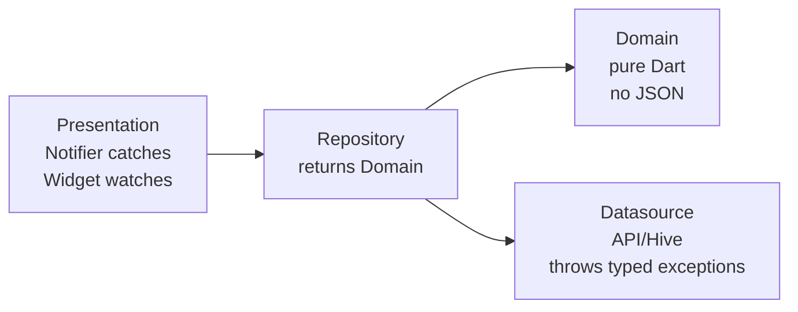

## Read first

1. This skill overrides generic Flutter/Dart advice.
2. Before code, read Trigger Map refs for touched areas; each ref's `Read first` section is canonical.
3. After `.dart`/`pubspec.yaml`/`build.yaml`/`analysis_options.yaml` writes, run package-root `dart analyze` and emit Pre-Flight.
4. Critical Rules override examples, public docs, and older project code.

## Gate

On skill activation, emit verbatim once:

> building-flutter-apps active. Pre-flight required.

Before writing any `.dart` code, emit verbatim:

> Reading building-flutter-apps gate.

After every code change to a `.dart` file (or to `pubspec.yaml` / `build.yaml` / `analysis_options.yaml`):

1. Run `dart analyze` from the package root. Block on any ERROR or WARNING.
2. Emit the filled-in Pre-Flight checklist. T0 always. T1 / T2 only if their domain was touched.
3. If `dart analyze` is not wired with `flutter_skill_lints`, run Setup before continuing.

## Critical Rules

1. **Use package-root `dart analyze` only.** Never `flutter analyze` or path-scoped analyze. Copy [references/analysis_options.yaml](references/analysis_options.yaml); wire `flutter_skill_lints` + `riverpod_lint` under `plugins:`. Ref: [flutter#184190](https://github.com/flutter/flutter/issues/184190).

2. **Use `@riverpod` / `@Riverpod` codegen for every provider** — state, computed, repository, datasource, service, family, stream. Never manual `Provider`, `FutureProvider`, `StreamProvider`, `StateProvider`, `StateNotifierProvider`, `NotifierProvider`, `AsyncNotifierProvider`, `ChangeNotifierProvider`. Run `dart run build_runner watch --delete-conflicting-outputs`.

3. **Guard every `await`** in notifiers and repositories with `if (!ref.mounted) return;`. Guard every `await` in widgets and `State` with `if (!context.mounted) return;`. Inside `State`, never use bare `mounted` / `this.mounted` — always `context.mounted`. **Inside `finally`, use the guard form `if (ref.mounted) { ... }`** — never `if (!ref.mounted) return;`. Lint: `bare_state_mounted_forbidden`.

4. **Extract widgets to public classes.** No `_buildXxx()` helpers. No top-level/global helper functions in widget/screen files; put behavior on a widget class, `abstract final class` namespace, notifier, or computed provider. No `class _Foo extends StatelessWidget | StatefulWidget | ConsumerWidget | ConsumerStatefulWidget | HookWidget | HookConsumerWidget`. Mark file-internal widgets `@visibleForTesting`. `_FooState extends State<Foo>` stays private (Flutter convention — exempt). Lint: `widget_top_level_function_boundary`.

5. **Nullability is a semantic contract.** Default to non-nullable types. Use `T?` only when absence is a real state (`unknown`, `not loaded`, `not applicable`, missing route lookup). Collections are non-null with empty defaults (`[]`, `{}`); use a sealed/AsyncValue state when `not loaded` differs from loaded-empty. Required domain strings are validated Value Objects, not raw `String`, `String?`, or `''`. Optional domain strings are `String?`; normalize blank input to `null` at the boundary. Empty `String` is allowed only for explicit transient UI draft/search/input text. Do not hide null or boolean state with sentinel fallbacks (`value ?? false`, `value ?? 0`, `value ?? ''`, `value ?? const []`, `flag ? '1' : '0'`), chained fallbacks, or `labelBuilder?.call(item) ?? item.toString()`; make the input required, branch explicitly, pattern match, or use a typed domain value. Use `Object?` or a specific type for unknown values. `dynamic` only for `Map<String, dynamic>` JSON. Never `value!` — use `if (value case final v?)`. Lints: `nullable_collection_type`, `state_empty_string_sentinel`, `state_bool_string_sentinel`, `domain_empty_string_sentinel`, `implicit_null_fallback`.

6. **Use `AppLocalizations` (gen-l10n)** for every user-facing string. Never hardcode UI copy in widgets, notifiers, repositories, or datasources. In widgets, bind `final l10n = context.l10n;` at the top of `build` and use `l10n.someKey`; never chain `context.l10n.someKey`. `*Strings` constants only for non-user-facing IDs. For l10n config, put ARB files in `arb-dir` (`lib/l10n` by default). Generated Dart is written to `${arb-dir}/${output-localization-file}` unless `output-dir` is set; import `app_localizations.dart` from that directory.

7. **Use Freezed as the only immutable value/state-class pattern.** Use `sealed class` with `@freezed`; never `abstract class` with `@freezed`, `@immutable`, or `@unfreezed`. Put each Freezed declaration in its own Dart source file so generated parts, imports, serialization, and ownership stay one-to-one. Match with Dart native `switch` — never Freezed `.when()` / `.map()`. For VOs in `/domain/values/`, annotate `@Freezed(map: FreezedMapOptions.none, when: FreezedWhenOptions.none)` to disable codegen of those methods entirely. Lints: `use_sealed_freezed_classes`, `use_freezed_instead_of_immutable`, `freezed_one_class_per_file`, `freezed_disable_map_when_required`.

8. **Never prop-drill state, infrastructure, or surface policy.** Child widgets read providers directly with `ref.watch` / `ref.read` / `ref.listen`. Do not pass entity / state / notifier instances through constructors. Do not pass provider-derived primitive values as `initial*` props when the child can read the provider by ID. Do not pass concrete cache managers, clients, storage, services, repositories, datasources, queues, or plugins into widgets; infra wiring belongs behind the owning provider, repository, datasource, service, or utility API. Constructor params allowed: immutable IDs (for routing/lookup), callbacks, `Key`, and primitive props on leaf atoms. Provider-derived caches must have one SSOT: generated computed provider, notifier/repo state, non-const instance-owned `late final` derived field, or memoized service/repo/datasource cache. Const Freezed state/entities cannot own `late final` caches; use computed providers for hot projections. Never use top-level/global `Expando` side tables for derived state or collection indexes. `ConsumerState` may own UI lifecycle handles only (controllers, focus, animation); never provider-derived `*Cache`/`*Source`/`*Snapshot`/`*Memo`/`*ById` fields, provider-family arg wrappers (`config`/`args`/`params`), local `isSubmitting`/`isSaving` flags for provider-owned mutations, or `ProviderSubscription` fields. `ref.listenManual` is forbidden; use `ref.listen` in `build` for widget UI side effects, or move durable subscriptions into provider/notifier/service lifecycles. Do not create standalone Riverpod `*Signal` / `*Event` / `*Pulse` / `*Serial` providers for one-shot UI events; fold the serial/payload into the owning notifier state and `ref.listen` to a concrete `.select((state) => state.successSerial)` field. Durable status providers must be named by the state they own, e.g. `*StatusNotifier` / `*Lifecycle`, not `*Signal`. Widgets are UI + dispatch only: no `try/catch`, no assigning/branching on awaited notifier results, no raw `Material(...)` / `Ink(...)` / `InkWell(...)` surfaces outside atoms/app shell/dedicated primitives, no top-level/global helper functions, no widget-file `*Actions` namespaces that accept `WidgetRef`/`BuildContext` and call providers, no provider-triggered `addPostFrameCallback` in `build`, no `*Data` helper namespaces that filter/map/sort/index collections, and no private collection/filter/sort helpers. Move that logic to notifiers, computed providers, a non-widget service/model class, or an owned atom/surface primitive. Lints: `riverpod_consumer_state_derived_cache`, `riverpod_widget_provider_arg_wrapper`, `riverpod_consumer_state_provider_subscription`, `riverpod_listen_manual_forbidden`, `riverpod_event_counter_signal_forbidden`, `expando_derived_cache_forbidden`, `widget_infra_dependency_boundary`, `widget_material_boundary`, `widget_top_level_function_boundary`, `widget_try_catch_boundary`, `widget_awaits_notifier_result`, `widget_local_mutation_flag`, `widget_derived_collection_logic`.

9. **Use a mixin when the same behavior appears in 2+ classes.** Extract to a `mixin` with an `on` clause (e.g. `mixin RetryMixin on AsyncNotifier<X>`). Suffix the name with `Mixin`. Copy-paste sharing across notifiers, widgets, or services is forbidden — replace with a mixin.

10. **Storage SDK calls live in Local Datasource, never in Notifier.** Hive (`Hive.openBox`, `box.get/put/delete`, `Hive.box`), `SharedPreferences`, `dart:io` file ops, `path_provider` directory access — all live behind a `Local<X>Datasource` interface, called by `<X>Repository`. Secret-store SDKs are not default app caches; add one only for real secrets after an explicit product/security requirement. Notifiers and widgets never import `hive_ce` / `shared_preferences` / `flutter_secure_storage` / `dart:io` / `path_provider`. Dependencies are required and explicitly wired at the provider/composition root; never hide production wiring behind `dependency ?? ConcreteDependency()`, optional/defaulted function seams such as `clock/delay/generator/authenticator/createExecution`, inline concrete dependency constructors such as `Service(plugin: ConcretePlugin())`, or `ref.watch` for stable service/repository/datasource/client/plugin wiring. Use `ref.read` for stable infrastructure deps; use `ref.watch` only where the provider's output is intentionally reactive. Lints: `hidden_dependency_fallback`, `hidden_dependency_default_param`, `service_inline_concrete_dependency`, `service_provider_watch_dependency`.

11. **Primitives → `core/extensions/`. Never inline.** Put `DateTime` / `String` / `int` / `double` / `num` / `Duration` / `Iterable` / `BuildContext` ops in `core/extensions/{type}_extensions.dart`; export via `extensions.dart`. Use `.timeAgo` / `.capitalized` / `.asCurrency` / `.clamped(...)` / `.pluralized(...)` / `.lookupByKey(...)` / `.indexOfByKey(...)`. Route-current checks use `context.isCurrentModalRoute`; never inline `ModalRoute.of(context).isCurrent` / `ModalRoute.isCurrentOf(context)` outside the context extension owner. Forbidden: manual capitalization, raw `DateTime.now()` chains, ad-hoc `NumberFormat`, ad-hoc `DateFormat`, inline `.formatted(pattern: ...)`, inline `.clamp(...)`, raw executable strings/numbers, one-off `items.indexBy((item) => item.id)[id]` call-site lookups. Date display call sites use semantic extension getters; new patterns are added inside `date_time_extensions.dart` or a dedicated non-call-site owner, then exposed through a semantic helper. Use `DateTimeX.nowUtc()`/`nowLocal()` + semantic calendar helpers. Persist/server timestamps in UTC; local buckets convert to local first. Domain entities never import `core/extensions/`; use entity getter or Value Object. Lints: `datetime_now_requires_timezone_intent`, `avoid_magic_literals`, `ad_hoc_id_index_lookup`, `use_context_is_current_modal_route`, `arch_domain_import`. See [extensions-utilities.md](references/extensions-utilities.md).

12. **Wrap domain primitives in Value Objects.** Domain-meaning `double`/`int`/`String` (unit, currency, measure, identity, format) → sealed Freezed VO in `/domain/values/`. Required domain text must be non-empty by construction; reject/normalize blank strings before entity creation. Raw redirects private (`._meters`/`._raw`). Public factories validate in body; no passthrough redirects. No named primitive factories on domain entities; convert at data/notifier/import boundaries. No hand-written `copyWith` in `/domain/`. Hive models keep primitives; domain entities hold VOs; mapper bridges. Never change ctor param type/order on shipped `@GenerateAdapters` class. Primitive in 2+ entities → VO. Bare `double distanceMeters` or `String email` at entity boundary = smell. See [value-objects.md](references/value-objects.md), [hive-persistence.md](references/hive-persistence.md). Lints: `vo_public_raw_constructor`, `domain_empty_string_sentinel`, `domain_entity_primitive_factory`, `domain_custom_copy_with`, `hive_field_no_vo_type`.

13. **Keep typed GoRouter routes as the navigation SSOT.** Define routes once with `go_router_builder`, then navigate with generated route helpers such as `SomeRoute(...).go(context)` and `SomeRoute(...).push<T>(context)`. Keep route paths inside route definitions and generated helpers. Same-flow child routes whose success exits the whole flow (auth/login/signup, onboarding step, destructive confirm, import wizard) use typed `pushReplacement`, not `push`, so success does not leave dead flow screens underneath. Local sheets/dialogs use semantic helpers and `Navigator.pop` for dismissal. Generic `BuildContext` pop fallback helpers (`popIfCan` / `popOrGo`) must check `mounted`, root `Navigator.maybeOf(...).canPop()`, and local `Navigator.maybeOf(...).canPop()` before falling back to typed route navigation. Navigation lints enforce typed routes, local modal helpers, and typed fallback behavior. Lint: `pop_fallback_helper_must_check_navigator_stack`.

14. **Dialogs/sheets pop with result; they do not host mutations.** Caller computes immutable `<Feature>Summary` via `ref.read`; dialog renders from snapshot. Dialog may watch only low-frequency primitive state (e.g. `isSaving`); timer/ticker/progress watches live in leaf controls. Buttons call `Navigator.pop(result)` with no code after. Notifier owns teardown (`reset()` on success, preserve failure state). Under `PopScope(canPop: false)` after awaited modal, use `<Route>().go(context)`, never pop fallback. `.select((value) => value)` is forbidden: select concrete fields/records, or watch a generated computed projection provider directly when the provider's whole value is already the render projection. Lints: `dialog_widget_subscribes_to_mutable_provider`, `modal_high_frequency_watch_not_leaf`, `dialog_button_pop_then_state_mutation`, `riverpod_select_identity_forbidden`, `select_returns_unstable_record_identity`, `build_method_assigns_to_field`, `build_calls_mutating_instance_method`, `widget_calls_notifier_teardown_after_await`, `popscope_bypass_uses_go_not_pop`. See [common-patterns.md](references/common-patterns.md#modal-snapshot-pattern), [state-management-lifecycle.md](references/state-management-lifecycle.md#state-teardown-belongs-in-the-notifier).

15. **Debounce, gate, and batch every high-frequency boundary.** Inputs that fire many times per gesture or sync cycle must coalesce before they touch a notifier, network, or disk. Foreground budgets are search/realtime debounce <=150ms, visual animation <=120ms, persistence/hard waits <=50ms; retry/backoff, rest timers, reminders, and sync/backfill settle timers belong in background/domain owners. `TextField` / `Slider` / scroll listeners → `Timer` (cancel-and-restart) or `Debouncer` (move terminal effects to `onChangeEnd`). Notifier persistence helpers (`_persistDraft`, `_schedule*Persist`) → cancel-and-restart `Timer` / `Future.delayed` / `Debouncer`; a queue/generation token prevents stale writes but is not debounce. Sync push of `.saveAll(items.map(Model.fromEntity).toList())` → guard with `if (changed.isEmpty) return` or an outer `isDirty` check. Long-running remote functions for delete/sync/import/export/migrate/generate flows → async-start plus source-of-truth reconciliation; do not block the client request. Destructive catch blocks reconcile before Crash/Sentry/Firebase reporting. Reset/clear methods must not preserve migration/version/install markers around `.clear()`; reset means a hard clear of app-owned local state. Subset mutation followed by full `saveAll` → changed-row `mergeAll` / `saveMany`. Collection getters used from UI/notifiers must be computed providers, service/repo caches, or non-const instance `late final` derived fields; never top-level/global `Expando` side-table caches. Repeated id lookup uses reusable indexes; one-off id lookup uses the shared Iterable extension (`lookupByKey` / `indexOfByKey`), not local helpers, `firstWhere`/`indexWhere`, or `items.indexBy((item) => item.id)[id]` at the call site. Heavy widgets (`InAppWebView`, `WebViewWidget`, `VideoPlayer`, `YoutubePlayer`) must not be constructed in `build()` without a `bool _userTapped... = false` gate set by an `onTap` callback. `*Service` storage reads (`_storage.read`, `_box.get`) need a `Map<String, ...>` memo field. `ref.listenManual(...)` is forbidden; use `ref.listen` in `build` for widget UI side effects or move durable subscriptions to provider/notifier/service lifecycle. `@Riverpod(keepAlive: true)` must NOT watch unbounded collection getters (`s.logs`, `s.posts`, `s.history`) — derive from a bounded projection. Abstract `*LocalDatasource` / `*RemoteDatasource` with 5+ single-value async getters MUST expose a `loadAll()` / `getSnapshot()` aggregator. Save callbacks accepting numeric named args MUST guard `> 0` / `isNotEmpty` before persisting. Unit-bearing primitive locals (`*Meters`/`*Seconds`/`*Cents`/`*Bytes`) passed across the widget→notifier boundary MUST be wrapped in a domain Value Object. Every `showDialog` / `showModalBottomSheet` / `show*Dialog` / `show*Sheet` helper MUST pass `routeSettings` so the modal appears in observer/analytics logs. Lints: `text_field_on_changed_no_debounce`, `slider_on_changed_no_debounce`, `scroll_listener_no_throttle`, `user_visible_duration_too_long`, `appwrite_blocking_function_execution_in_client`, `destructive_failure_logged_before_reconcile`, `storage_clear_preserves_migration_state`, `notifier_persistence_no_debounce`, `sync_save_all_no_dirty_guard`, `save_all_full_collection_after_subset_mutation`, `collection_getter_allocates_each_access`, `expando_derived_cache_forbidden`, `ad_hoc_id_index_lookup`, `linear_id_lookup_in_hot_path`, `nested_linear_lookup_by_id`, `webview_init_in_build_no_gate`, `service_storage_read_no_memo`, `riverpod_listen_manual_forbidden`, `keepalive_watches_unbounded_collection`, `datasource_missing_batch_loader`, `notifier_zero_value_save_no_guard`, `notifier_param_requires_value_object`, `modal_helper_requires_route_settings`. See [common-patterns.md](references/common-patterns.md#debounce-gate-and-batch), [services-and-singletons.md](references/services-and-singletons.md), [value-objects.md](references/value-objects.md).

16. **Keep the app shell declarative.** The widget that returns `MaterialApp`, `CupertinoApp`, or `WidgetsApp` owns shell config only: router, theme, l10n, builder, navigator/scaffold keys. Do not put bootstrap/service-wiring `ref.listen` calls in the app shell. Put root lifecycle listeners in a dedicated bootstrap `ConsumerWidget` directly under `ProviderScope` and above the app shell. Use `ref.watch` there for eager provider initialization (select a stable readiness field when possible); use `ref.listen` at the root of `build` only for UI side effects such as navigation, dialogs/snackbars, logging, or splash removal. Lint: `app_shell_bootstrap_side_effects`. See [common-patterns.md](references/common-patterns.md#app-shell-bootstrap-boundary).

17. **Keep control flow flat after exits.** If an `if` branch exits with `return`, `throw`, `break`, or `continue`, do not wrap the following branch in `else`. Remove the `else` and put the continuation after the guard branch. `else if` chains are exempt. Lint: `avoid_unnecessary_else_after_control_flow`.

18. **Use `onReorderItem` index semantics directly.** `ReorderableListView`, `SliverReorderableList`, and `ReorderableList` use `onReorderItem`, never deprecated framework `onReorder`. `onReorderItem` already passes the post-removal `newIndex`: pass `(oldIndex, newIndex)` through unchanged, insert at `newIndex`, and never add adapter math (`newIndex > oldIndex ? newIndex + 1 : newIndex`) or downstream legacy math (`if (oldIndex < newIndex) newIndex -= 1`). Lint: `use_on_reorder_item_index_semantics`.

19. **Use the `flutter_local_notifications` exact-alarm permission API.** For Android exact alarms, call `AndroidFlutterLocalNotificationsPlugin.canScheduleExactNotifications()` and then `requestExactAlarmsPermission()` when needed. Do not launch `android.settings.REQUEST_SCHEDULE_EXACT_ALARM` manually with `AndroidIntent`; the plugin handles the app-specific settings intent and re-checks permission on return. Catch `PlatformException` at the service/repository boundary and return a deterministic failure state. Lint: `use_local_notifications_exact_alarm_permission_api`.

20. **Resolve platform-specific plugin implementations before use.** `resolvePlatformSpecificImplementation<T>()` returns a nullable platform implementation. Assign it to a local variable or narrow helper getter, handle `null` explicitly, then call platform-specific members. Do not chain directly into `?.method()`, `?.property`, or `!.method()`. Lint: `resolve_platform_specific_implementation_before_use`.

## Trigger Map

Before writing code in any row below, output `Reading: <ref-name>` and read the listed reference(s).

| Touching | Read |
|---|---|
| Notifier, AsyncNotifier, mutation method, `ref.read` / `ref.watch` / `ref.listen`, `_ensureRepository`, async cancellation, sync `Notifier` init, teardown, error state | [state-management.md](references/state-management.md) + [state-management-lifecycle.md](references/state-management-lifecycle.md) |
| Freezed entity, sealed union, `fromJson` / `toJson`, `copyWith`, model vs entity, `build.yaml` for `explicit_to_json` | [freezed-sealed.md](references/freezed-sealed.md) |
| Provider declaration, `@riverpod`, family, `keepAlive`, codegen, `Mutation<T>` (experimental) | [riverpod-codegen.md](references/riverpod-codegen.md) |
| Repository, datasource, domain entity, layered architecture, `IHttpService`, mapping models to entities | [architecture.md](references/architecture.md) |
| Value Object, primitive obsession, `Distance`/`Money`/`Email`/`Slug`, unit conversion in domain, cross-entity primitive, `double distanceMeters`/`int amountCents`/`String email` smell, `arch_domain_import` error | [value-objects.md](references/value-objects.md) |
| GoRouter, typed route, redirect, `context.go`, deep link, cold-start, navigation gate | [architecture.md](references/architecture.md) + [deep-linking.md](references/deep-linking.md) |
| HTTP, network, REST, source-of-truth fetch after mutation, long-running remote function, async-start + reconcile, transport id vs domain id | [networking.md](references/networking.md) + [common-patterns.md](references/common-patterns.md#remote-functions-destructive-reconciliation) |
| Atom, molecule, organism, design tokens, atomic widgets, `core/widgets/` promotion | [atomic-design.md](references/atomic-design.md) |
| Widget test, `ProviderContainer.test()`, `UncontrolledProviderScope`, fakes, mocks, `AppWidgetKeys`, event-contract tests | [testing.md](references/testing.md) |
| `flutter_driver`, Dart MCP, E2E, `integration_test`, semantic selectors, log capture | [dart-mcp-e2e-testing.md](references/dart-mcp-e2e-testing.md) |
| Hive, `TypeAdapter`, TypeId, box, persistence migration, retired field accounting | [hive-persistence.md](references/hive-persistence.md) |
| Crashlytics, FirebaseCrashlytics, error reporting, `Crash.init`, `Crash.error`, `Crash.log`, symbol upload | [crashlytics.md](references/crashlytics.md) |
| Mixin, capability vs interface, retry helper, RNG, bulk operation | [mixins.md](references/mixins.md) |
| Service, singleton, fire-and-forget, `abstract final class`, `unawaited()`, `Future<void>` signature | [services-and-singletons.md](references/services-and-singletons.md) |
| `@Preview`, `widget_previews.dart`, preview fakes, deterministic preview data | [widget-previews.md](references/widget-previews.md) |
| `AppLocalizations`, ARB file, gen-l10n, locale fallback, placeholders, plural / select | [localization.md](references/localization.md) |
| Performance, build cost, `.select()`, `const` constructors, `ListView.builder`, large list compute | [performance.md](references/performance.md) + [flutter-optimizations.md](references/flutter-optimizations.md) |
| `LayoutBuilder`, `RenderFlex` overflow, `Expanded` / `Flexible` outside `Row` / `Column`, `Positioned` outside `Stack`, text-scale clamp | [layout-diagnostics.md](references/layout-diagnostics.md) |
| Extension, `SnackBarUtils`, snackbar dispatch from notifier, `@visibleForTesting` helpers, `DateTime` format/diff/timeAgo/startOfDay, `String` capitalize/truncate/titleCase/initials/format, `int` / `double` / `num` clamp/pluralized/asCurrency/percent/toFixed, `Duration` format, parse/format, `BuildContext` helpers, `ModalRoute` current-route checks, `NumberFormat`, `DateFormat`, `intl`, `core/extensions/` | [extensions-utilities.md](references/extensions-utilities.md) |
| Records `(x, y)`, extension type IDs, pattern matching, guard clause `case _ when ...` | [dart-patterns-records.md](references/dart-patterns-records.md) |
| `analysis_options.yaml`, `dart analyze`, plugin wiring, `riverpod_lint` version pin, analyzer crash | [analysis-options.md](references/analysis-options.md) + [analysis_options.yaml](references/analysis_options.yaml) |
| Common navigation / form / list / debounce / route-param-fallback patterns | [common-patterns.md](references/common-patterns.md) |
| Dialog / sheet / modal, `showDialog`, `showModalBottomSheet`, `show*Dialog` helper, snapshot value object, post-await teardown, `Navigator.pop(result)` | [common-patterns.md](references/common-patterns.md#modal-snapshot-pattern) + [state-management-lifecycle.md](references/state-management-lifecycle.md#state-teardown-belongs-in-the-notifier) |
| Debounce / throttle / coalesce — `TextField.onChanged`, `Slider.onChanged`, scroll listener, sync `saveAll`, full-collection rewrite after subset mutation, persistence helper, long-running remote function, destructive reconcile-before-log, reset/clear sentinel preservation, collection getter allocation, repeated id lookup, `_userTapped` gate, `WebView` / `VideoPlayer` in `build`, `_storage.read` in service, `ref.listenManual` ban, keepAlive collection watch, datasource batch loader, zero-value save guard, primitive→VO at notifier boundary, `routeSettings` on modal helper | [common-patterns.md](references/common-patterns.md#debounce-gate-and-batch) |

## Core Stack

Version SSOT: [README.md → Core Stack](README.md).

| Package | Version | Purpose |
|---------|---------|---------|
| flutter_riverpod + riverpod_annotation + riverpod_generator | `^3.3.1` / `^4.0.2` / `^4.0.3` | State management (codegen) |
| freezed + freezed_annotation | `^3.2.5` / `^3.1.0` | Immutable data classes, unions |
| go_router + go_router_builder | `^17.2.3` / `^4.3.0` | Declarative, type-safe routing |
| json_serializable + build_runner | `6.13.0` / `^2.15.0` | JSON serialization + code generation |
| hive_ce + hive_ce_flutter + hive_ce_generator | `^2.19.3` / `^2.3.4` / `1.11.0` | Local persistence |

## Architecture



```
lib/
├── core/
├── features/
│   └── feature_x/
│       ├── data/           # Models, datasources (API / local)
│       ├── domain/         # Entities (pure Dart, no Flutter imports)
│       ├── repositories/   # Map models → entities
│       └── presentation/   # Notifiers, screens, widgets
└── main.dart
```

## Class Modifiers

| Modifier | Extend outside lib | Implement outside lib | Instantiate | Mixin |
|---|:---:|:---:|:---:|:---:|
| `abstract class` | ✓ | ✓ | ✗ | ✗ |
| `abstract interface class` | ✗ | ✓ | ✗ | ✗ |
| `abstract final class` | ✗ | ✗ | ✗ | ✗ |
| `sealed class` | ✗ | ✗ | ✗ | ✗ |
| `base class` | ✓ | ✗ | ✓ | ✗ |
| `interface class` | ✗ | ✓ | ✓ | ✗ |
| `final class` | ✗ | ✗ | ✓ | ✗ |
| `mixin class` | ✓ | ✓ | ✓ | ✓ |

`abstract interface class` for repository / datasource contracts. `sealed class` for Freezed unions. `abstract final class` for pure helper namespaces and tiny fire-and-forget static facades (`Crash`, logging/analytics wrappers). Plain singleton = private constructor + one `static final instance` + fire-and-forget (`void` / `Future<void>`) API only.

## Code Generation

```bash
dart run build_runner watch --delete-conflicting-outputs
dart run build_runner build --delete-conflicting-outputs
dart run build_runner clean && dart run build_runner build --delete-conflicting-outputs
```

## Setup

1. Copy [references/analysis_options.yaml](references/analysis_options.yaml) to project root. It already wires `flutter_skill_lints` + `riverpod_lint` under `plugins:`.
2. Copy [templates/flutter/lib/core/extensions/](templates/flutter/lib/core/extensions/) into `lib/core/extensions/` for every new Flutter app. If the project already has extension files, merge the template instead of overwriting.
3. `flutter_skill_lints` is an analyzer plugin — it lives **only** in `analysis_options.yaml plugins:`. Never add it to `pubspec.yaml`.
4. Run `dart pub get`. Confirm `dart analyze` exits 0.
5. Sanity check: write `Widget _buildHeader() => const SizedBox();` — `dart analyze` must flag it. Sanity check route-current enforcement: write `ModalRoute.isCurrentOf(context);` outside `lib/core/extensions/context_extensions.dart` — `dart analyze` must flag `use_context_is_current_modal_route`.

### Per-Tool Hooks

| Tool | Auto-install command | Hook source |
|---|---|---|
| Claude Code | `/plugin marketplace add sgaabdu4/building-flutter-apps` then `/plugin install building-flutter-apps@building-flutter-apps`; run `/reload-plugins` in the active session | `hooks/hooks.json` |
| Codex CLI | `codex features enable hooks`, `codex features enable plugin_hooks`, `codex plugin marketplace add sgaabdu4/building-flutter-apps`, then `codex` → `/plugins` → install | `hooks/hooks.json` |
| Copilot CLI | `copilot plugin marketplace add sgaabdu4/building-flutter-apps` then `copilot plugin install building-flutter-apps@building-flutter-apps` | `hooks/hooks.copilot.json` |

Raw skill installs are guidance-only. They load this file but cannot register
runtime hooks or run scanners. Use plugin installs when enforcement matters.

## Pre-Flight

Fill T0 always after any `.dart` write. Fill T1 if state / notifier / mutation touched. Fill T2 if network / E2E / stream / route touched. Emit before yielding the turn.

### T0

- [ ] `dart analyze` exits 0 with `flutter_skill_lints` + `riverpod_lint` wired
- [ ] `if (!ref.mounted) return;` after every `await` in notifiers and repositories
- [ ] `if (!context.mounted) return;` after every `await` in widgets and `State`; no bare `mounted` / `this.mounted` anywhere in widgets (`bare_state_mounted_forbidden`)
- [ ] Inside `finally`, use guard form `if (ref.mounted) { ... }` — never early-return
- [ ] No `_buildXxx()`, no top-level/global helper functions in widget/screen files, and no private widget classes extending Stateless / Stateful / Consumer / Hook widgets (`State` subclasses exempt)
- [ ] App shell widget (`MaterialApp` / `CupertinoApp` / `WidgetsApp`) has no bootstrap/service-wiring `ref.listen`; root lifecycle listeners live in a dedicated bootstrap widget
- [ ] No `dynamic` except `Map<String, dynamic>` for JSON; no `value!`
- [ ] Nullability has semantics: no nullable collection types outside wire DTOs; no empty-string sentinels in domain/state; no boolean `'1'`/`'0'` string sentinels; no primitive/string/toString/chained `??` sentinel fallbacks; optional strings normalize blank to `null`, required strings use VOs (`nullable_collection_type`, `state_empty_string_sentinel`, `state_bool_string_sentinel`, `domain_empty_string_sentinel`, `implicit_null_fallback`)
- [ ] Widgets bind `final l10n = context.l10n;` before localized key reads; no chained `context.l10n.someKey`
- [ ] All providers `@riverpod` codegen; no manual `Provider(...)` family
- [ ] No prop-drilling: children watch providers directly. No entity / state / notifier in constructors
- [ ] No concrete infra deps in widget constructors/props: cache managers, clients, storage, services, repositories, datasources, queues, plugins (`widget_infra_dependency_boundary`)
- [ ] Provider-derived caches and one-shot event serials/payloads have one SSOT (computed provider/notifier/repo/service or non-const instance `late final` derived field); no standalone `*Signal` / `*Event` / `*Pulse` / `*Serial` providers, `ConsumerState` cache/source/snapshot/memo/by-id fields, provider-family arg wrappers (`config`/`args`/`params`), top-level/global `Expando` derived caches, local `isSubmitting`/`isSaving` flags for provider-owned mutations, or `ProviderSubscription` fields; no `ref.listenManual` (`riverpod_consumer_state_derived_cache`, `riverpod_widget_provider_arg_wrapper`, `riverpod_consumer_state_provider_subscription`, `riverpod_listen_manual_forbidden`, `riverpod_event_counter_signal_forbidden`, `expando_derived_cache_forbidden`, `widget_local_mutation_flag`)
- [ ] Widgets are UI + dispatch only: no `try/catch`, no awaited notifier result branching, no raw `Material(...)` / `Ink(...)` / `InkWell(...)` surfaces outside atoms/app shell/dedicated primitives, no top-level/global helper functions, no widget-file `*Actions` namespaces with `WidgetRef`/provider calls, no provider-triggered `addPostFrameCallback` in `build`, no `*Data` helper namespaces that filter/map/sort/index collections, no private collection/filter/sort helpers (`widget_material_boundary`, `widget_top_level_function_boundary`, `widget_try_catch_boundary`, `widget_awaits_notifier_result`, `widget_local_mutation_flag`, `widget_derived_collection_logic`)
- [ ] Shared behavior across 2+ classes lives in a `mixin` (suffixed `Mixin`), not copy-pasted
- [ ] No `hive_ce` / `shared_preferences` / `flutter_secure_storage` / `dart:io` / `path_provider` imports in notifier or widget files — storage goes through `Local<X>Datasource` → `<X>Repository`; secret-store SDKs only by explicit product/security requirement; no production `dependency ?? ConcreteDependency()` or optional/defaulted dependency/function seams (`hidden_dependency_fallback`, `hidden_dependency_default_param`)
- [ ] No inline concrete dependency construction inside service wiring; SDK/plugin/client instances have one provider/composition-root owner, and stable service/repository/datasource/client/plugin wiring uses `ref.read`, not `ref.watch` (`service_inline_concrete_dependency`, `service_provider_watch_dependency`)
- [ ] No unnecessary `else` after an exiting branch (`return` / `throw` / `break` / `continue`); flatten guard-style control flow (`avoid_unnecessary_else_after_control_flow`)
- [ ] Reorderable widgets use `onReorderItem` directly: no framework `onReorder`, no inverse adapter math, no downstream `newIndex -= 1` legacy adjustment (`use_on_reorder_item_index_semantics`)
- [ ] Android exact-alarm permission flows using `flutter_local_notifications` call `canScheduleExactNotifications()` / `requestExactAlarmsPermission()` directly; no manual `AndroidIntent(action: 'android.settings.REQUEST_SCHEDULE_EXACT_ALARM')` (`use_local_notifications_exact_alarm_permission_api`)
- [ ] Platform-specific plugin access resolves `resolvePlatformSpecificImplementation<T>()` before use with explicit null handling; no direct `?.method()`, `?.property`, or `!.method()` chain (`resolve_platform_specific_implementation_before_use`)
- [ ] No inline primitive ops outside `core/extensions/` — use `.capitalized` / `.timeAgo` / `.asCurrency` / `.clamped(...)` / `.pluralized(...)` / `DateTimeX.nowUtc()` / `context.isCurrentModalRoute`. Forbidden: `'${s[0].toUpperCase()}...'`, date now/diff/UTC/timestamp chains, local calendar windows, ad-hoc `NumberFormat`, ad-hoc `DateFormat`, inline `.formatted(pattern: ...)`, inline `.clamp(...)`, raw `ModalRoute` current-route checks, raw key/id/limit/threshold literals
- [ ] Domain entity imports = `freezed_annotation` + `/domain/` paths only. Zero `core/`, `data/`, `presentation/`, `package:flutter`, `dart:ui`
- [ ] Value/state classes use `@freezed sealed class` only: no `@immutable`, no `@unfreezed`, no multiple Freezed declarations in one source file (`use_freezed_instead_of_immutable`, `freezed_one_class_per_file`)
- [ ] Domain primitives with unit / currency / measure / identity wrapped in VO (`Distance`/`Money`/`Email`) — no bare `double distanceMeters` / `int amountCents` / `String email` at entity boundary
- [ ] VO raw redirects PRIVATE (`._meters` / `._raw`); only validated factories public (`vo_public_raw_constructor`)
- [ ] No named primitive factories on `@freezed` domain entities (`factory User.fromPrimitives(...)` forbidden — convert at data/notifier/import boundary) (`domain_entity_primitive_factory`)
- [ ] No hand-written `copyWith` in `/domain/` — let Freezed generate from the redirect (`domain_custom_copy_with`)

### T1 — State / Notifier / Mutation

- [ ] Mutation methods (`create*`, `update*`, `delete*`, `set*`, `reorder*`) resolve deps lazily via a stateless helper/mixin; no notifier-local `_repository` / `_repo` / `_service` cache fields unless the field owns a disposable lifecycle resource (`notifier_local_dependency_cache`)
- [ ] Sync `Notifier.build()` does not read `state` before first return; seed via constructor; defer async with `Future.microtask`
- [ ] `ref.onDispose()` cancels every subscription / controller / timer
- [ ] No provider-derived `*Cache`/`*Source`/`*DayStart`/`*TodayStart` fields in `ConsumerState`; use computed providers or local `build` values
- [ ] Notifier owns snackbar dispatch — widgets do not call `SnackBarUtils.show*` or `ScaffoldMessenger.of(context)`
- [ ] Long-running sync / auth / import flows guard stale async writes
- [ ] No `ref.watch` inside notifier method body — `ref.watch` in `build()` only; `ref.read` in callbacks

### T2 — Network / E2E / Stream / Route

- [ ] Source-of-truth fetch after mutation when backend generates / normalizes / reorders / derives values
- [ ] Observer + writer E2E proof present for shared / realtime / collaborative state
- [ ] All `ValueKey` from central `AppWidgetKeys` registry — no inline string `ValueKey('...')`
- [ ] E2E entrypoint deterministic (`lib/main_dev.dart` or equivalent); test overrides isolated from `main.dart`
- [ ] GoRouter redirect logic in pure `resolveAppRedirect(...)`, matrix-tested; nullable by-id provider for route params with fallback UI; call sites use generated typed route helpers
- [ ] Cross-runtime constants / schema / function contracts have drift tests
- [ ] No `MediaQuery.withClampedTextScaling` in `MaterialApp` builder
