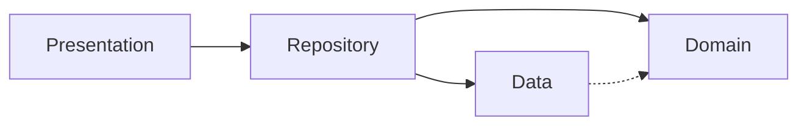
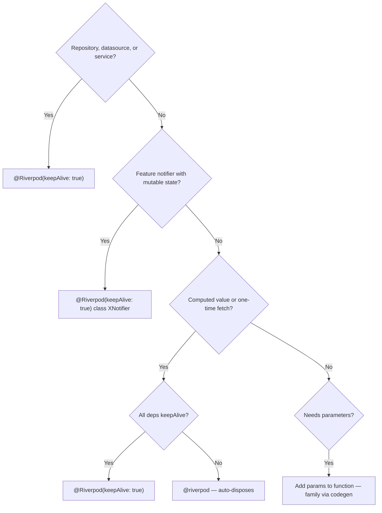

## MANDATORY — Read Before Writing Any Code

**Read this section + linked refs before code.**

1. **MUST copy [analysis-options.md](references/analysis-options.md) `analysis_options.yaml` verbatim into every project root.**
2. **MUST read [architecture.md](references/architecture.md) BEFORE creating any feature module, entity, model, datasource, or repository.**
3. **MUST read [freezed-sealed.md](references/freezed-sealed.md) BEFORE creating any Freezed class.**
4. **MUST read [state-management.md](references/state-management.md) BEFORE creating any notifier.**
5. **MUST read [performance.md](references/performance.md) BEFORE writing any widget tree or provider.**
6. **NEVER** use `dynamic`, `_buildXxx()` helpers, hardcoded strings, `shrinkWrap: true`, value!, or `abstract class` with Freezed.
7. **ALWAYS** check `if (!ref.mounted) return;` after every `await` in notifiers.
8. **NEVER** read `state` (incl. `state.copyWith`) in sync `Notifier` before `build()` returns. Seed via returned constructor, defer async init via `Future.microtask`. See [state-management.md](references/state-management.md#sync-notifier-initialization-trap).
9. **ALWAYS** init repositories inside mutation methods (`create*`, `update*`, `delete*`, `set*`, `reorder*`) via `_ensureRepository()`/`_ensureDependencies()` helper. NEVER rely only on `build()`/`_init()` timing for write paths.
10. **When touching guided tours, MUST read [showcase-tours.md](references/showcase-tours.md) first. NEVER filter `startShowCase()` keys with `key.currentContext` checks.**

## Core Stack

| Package | Purpose |
|---------|----------|
| flutter_riverpod + riverpod_annotation + riverpod_generator | State management (codegen) |
| freezed + freezed_annotation | Immutable data classes, unions |
| go_router + go_router_builder | Declarative, type-safe routing |
| json_serializable + build_runner | JSON serialization + code generation |
| showcaseview | First-run guided tours |
| hive_ce + hive_ce_flutter | Local persistence |

## Architecture



```
lib/
├── core/           # Shared: theme, utils, widgets, navigation, services
├── features/
│   └── feature_x/
│       ├── data/           # Models, datasources (API/local)
│       ├── domain/         # Entities (pure Dart, no dependencies)
│       ├── repositories/   # Map models → entities
│       └── presentation/   # Notifiers, screens, widgets
└── main.dart
```

## Critical Rules

1. **Codegen only** — `@riverpod` / `@Riverpod(keepAlive: true)`. NEVER legacy `StateProvider`, `StateNotifierProvider`.
2. **Sealed classes** — `sealed class` with Freezed. NEVER `abstract class`.
3. **No prop drilling** — child widgets watch providers direct.
4. **Guard async** — `if (!ref.mounted) return;` after EVERY `await` in notifiers. `if (!context.mounted) return;` in widgets.
5. **Single Ref** — Riverpod 3.0 unified Ref types. NEVER `AutoDisposeRef`, `FutureProviderRef`.
6. **Select in leaves** — `ref.watch(provider.select((s) => s.field))` in leaf widgets.
7. **One primary class per file** — exception: Freezed state + notifier may share file.
8. **Interface contracts** — `abstract interface class` for every repo + datasource. Constructors take interfaces, NEVER concrete types.
9. **No `dynamic`** — use `Object?` or proper type. Exception: `Map<String, dynamic>` in JSON.
10. **Widget classes only** — NEVER `_buildXxx()` helpers. Extract to named widget classes.
11. **No hardcoded strings** — `*Strings` constants classes with `static const`.
12. **ref.watch in build, ref.read in callbacks.**
13. **Provider naming** — codegen strips "Notifier": `FooNotifier` → `fooProvider`.
14. **No `shrinkWrap: true`** — use `Sliver` variants or constrained containers.
15. **Mixins for capabilities, interfaces for contracts** — see [mixins.md](references/mixins.md).
16. **No null-bang** — NEVER value!. Use `if (value case final v?)`.
17. **`abstract final class` for static-only namespaces** — NEVER `Class._()`. Exception: `const Entity._()` in Freezed.
18. **`ref.invalidate` not `ref.refresh`** when no return value needed.
19. **Persistence SSOT** — Default to repository/data persistence. Notifier persistence opt-in. One persistence owner per feature state.
20. **Pop safely with GoRouter** — For dismiss/back on pushable or deep-linkable screens, guard `context.pop()` with `context.canPop()`. If true, pop + return. Else navigate to typed fallback (`const MyRoute().go(context)`).
21. **No silent mutation no-op** — Mutation methods must not return early just because cached repo field null; lazily init deps first, then proceed or fail explicit.
22. **Route-param safety in widgets** — NEVER throw from widget `build()` for missing route IDs. Use nullable by-id providers + fallback UI. See [common-patterns.md](references/common-patterns.md#route-param-safety--wizard-sequencing).
23. **Navigation-critical mutation sequencing** — In wizard/deep-link flows: persist write → targeted state sync → navigate. See [common-patterns.md](references/common-patterns.md#route-param-safety--wizard-sequencing) and [state-management.md](references/state-management.md).
24. **Showcase replay safety** — Pass full ordered key list to `startShowCase()`. Do not gate by `key.currentContext != null` / mounted checks; readiness is handled by scope registration + scheduling.

## Provider Decision Tree



**Family + keepAlive caveat.** Family + `@Riverpod(keepAlive: true)` keeps every key forever. Cache can grow unbounded. Prefer `@riverpod`.

**Nested computed hop warning.** Avoid computed -> computed chain in pause-sensitive paths (`aProvider` watches `bProvider(param)`). Riverpod 3.2.x offstage nav can throw TickerMode pause/resume assertion.

If chain required, flatten in parent provider:
- watch base state directly
- derive via pure helpers
- avoid provider -> provider indirection on hot navigation paths

**Exception:** Riverpod 3.2.x has TickerMode assertion bug ([rrousselGit/riverpod#4709](https://github.com/rrousselGit/riverpod/issues/4709)). If hit, `keepAlive: true` workaround allowed. Add inline note: `// keepAlive: Riverpod 3.2.x #4709 workaround`. Remove after upstream fix.

## Anti-Patterns

| Wrong | Right |
|-------|-------|
| `StateProvider` | `@riverpod` codegen |
| `abstract class` with Freezed | `sealed class` |
| Pass state through constructors | Child watches provider directly |
| Missing `ref.mounted` after `await` | `if (!ref.mounted) return;` |
| Auto-dispose with all-keepAlive deps | `@Riverpod(keepAlive: true)` |
| Try-catch at every layer | Catch once in notifier |
| `context.go('/path')` string | `const MyRoute().go(context)` typed |
| Entity in datasource | `Model` with `toEntity()` in repo |
| Assume domain `id` equals backend row/document id in datasource update/delete | Keep ids separate. Resolve transport id first, then update/delete |
| `@JsonSerializable(explicitToJson: true)` per class | `explicit_to_json: true` in `build.yaml` |
| `@Freezed(toJson: true)` when `fromJson` exists | Plain `@freezed` |
| Concrete type in constructor | `abstract interface class` |
| value! null-bang | `if (value case final v?)` |
| `class Foo { Foo._(); }` | `abstract final class Foo` |
| `ref.refresh(provider)` discarding return | `ref.invalidate(provider)` |
| `@Riverpod(keepAlive: true)` on family provider | `@riverpod` (auto-dispose) |
| Side-effect loading/error in notifier state | `Mutation<T>()` — see [riverpod-codegen.md](references/riverpod-codegen.md) |
| `ref.read` in `initState` | `addPostFrameCallback` then read |
| `state.copyWith(...)` before first `state=` in sync `Notifier.build()` (incl. `_load()` called sync from build, or `ref.listen(..., fireImmediately: true)` callback that reads state) | Seed via returned constructor + `Future.microtask(_load)`, OR `state = const FooState()` before `fireImmediately` listener. See [state-management.md](references/state-management.md#sync-notifier-initialization-trap) |
| Mutation method (`create*`, `update*`, `delete*`, `set*`) does `if (_repository == null) return ...` | Use `_ensureRepository()`/`_ensureDependencies()` with `await`, then guard with `if (!ref.mounted) return ...` |
| `context.pop()` without guard on dismiss/back callbacks | `if (context.canPop()) { context.pop(); return; } const MyRoute().go(context);` |
| `context.pop()` then immediately push route (modal still animating) | `Navigator.of(context).maybePop().then((_) { if (ctx.mounted) nav(); })` — see [common-patterns.md](references/common-patterns.md#dismiss-modal--push-route-bottom-sheet-navigation) |
| `firstWhere(... orElse: () => throw StateError(...))` in widget `build()` for route IDs | Nullable by-id provider + fallback UI (no throw). See [common-patterns.md](references/common-patterns.md#route-param-safety--wizard-sequencing) |
| `ref.invalidate(parentProvider)` right after child create/delete in active wizard/deep-link flow | Persist write → targeted parent sync → navigate. See [state-management.md](references/state-management.md) |
| `using context` after `await` | `if (!context.mounted) return;` |
| Mixin vs interface vs extension choices | See [mixins.md](references/mixins.md) |

Full patterns: [common-patterns.md](references/common-patterns.md) | [extensions-utilities.md](references/extensions-utilities.md)

## Class Modifiers

| Modifier | Extend outside lib | Implement outside lib | Instantiate | Mixin |
|---|:---:|:---:|:---:|:---:|
| `abstract class` | ✓ | ✓ | ✗ | ✗ |
| `abstract interface class` | ✗ | ✓ | ✗ | ✗ |
| `abstract final class` | ✗ | ✗ | ✗ | ✗ |
| `sealed class` | ✗ | ✗ | ✗ | ✗ |
| `base class` | ✓ | ✗ | ✓ | ✗ |
| `interface class` | ✗ | ✓ | ✓ | ✗ |
| `final class` | ✗ | ✗ | ✓ | ✗ |
| `mixin class` | ✓ | ✓ | ✓ | ✓ |

## Code Generation

```bash
dart run build_runner watch -d   # Watch mode (recommended)
dart run build_runner build -d   # One-time build
dart run build_runner clean && dart run build_runner build -d  # Clean build
```

## References

Read before generating code for that topic.

| File | When |
|------|------|
| [performance.md](references/performance.md) | **Always** — any widget or provider |
| [architecture.md](references/architecture.md) | Feature modules, layers, interfaces |
| [riverpod-codegen.md](references/riverpod-codegen.md) | Providers, mutations, lifecycle |
| [freezed-sealed.md](references/freezed-sealed.md) | Entities, models, unions, serialization |
| [state-management.md](references/state-management.md) | Notifiers, error handling, cross-provider |
| [analysis-options.md](references/analysis-options.md) | **Every project** — linter config |
| [flutter-optimizations.md](references/flutter-optimizations.md) | Scrolling, animation, concurrency |
| [atomic-design.md](references/atomic-design.md) | Shared widgets in `core/widgets/` |
| [testing.md](references/testing.md) | Unit/widget tests |
| [dart-mcp-e2e-testing.md](references/dart-mcp-e2e-testing.md) | Dart MCP runtime E2E flow, logs, device targeting, fail/fix loop |
| [common-patterns.md](references/common-patterns.md) | Lists, search, forms, GoRouter, sync |
| [extensions-utilities.md](references/extensions-utilities.md) | Utilities, extensions |
| [mixins.md](references/mixins.md) | Mixin vs interface vs extension |
| [hive-persistence.md](references/hive-persistence.md) | Local storage, Hive adapters |
| [services-and-singletons.md](references/services-and-singletons.md) | Static-only class vs singleton vs provider, fire-and-forget pattern, testing each |
| [crashlytics.md](references/crashlytics.md) | Firebase Crashlytics setup (3 hooks), `Crash` wrapper, non-fatal vs fatal, breadcrumbs, custom keys, symbols |
| [showcase-tours.md](references/showcase-tours.md) | Guided tours, tour state sync |
| [dart-patterns-records.md](references/dart-patterns-records.md) | Records, patterns, extension types |

## Pre-Flight — Before Returning Any Code

- [ ] `analysis_options.yaml` from [analysis-options.md](references/analysis-options.md) in project root
- [ ] `if (!ref.mounted) return;` after EVERY `await` in notifiers
- [ ] `if (!context.mounted) return;` after EVERY `await` in widgets
- [ ] No `_buildXxx()` helpers — extracted to widget classes
- [ ] No hardcoded strings — `*Strings` constants classes
- [ ] No `dynamic` — `Object?` or proper types
- [ ] No value! — `if (value case final v?)`
- [ ] `ref.watch()` in `build()`, `ref.read()` only in callbacks
- [ ] Sync `Notifier.build()` never reads `state` before first `state=` — loading flags seeded via returned constructor; async init dispatched with `Future.microtask`; no `fireImmediately: true` listener that reads state without prior direct `state =` assignment
- [ ] Every notifier mutation method lazily inits repositories/deps (`_ensureRepository`/`_ensureDependencies`) before writes
- [ ] Route-param lookups in widget `build()` are nullable (no throw-on-missing-id)
- [ ] Wizard/deep-link mutation sequence: persist → targeted sync → navigate
- [ ] If showcase code changed: `startShowCase()` uses full `ShowcaseKeys.*Tour` list (no `key.currentContext` filtering), and replay/reset path follows [showcase-tours.md](references/showcase-tours.md)