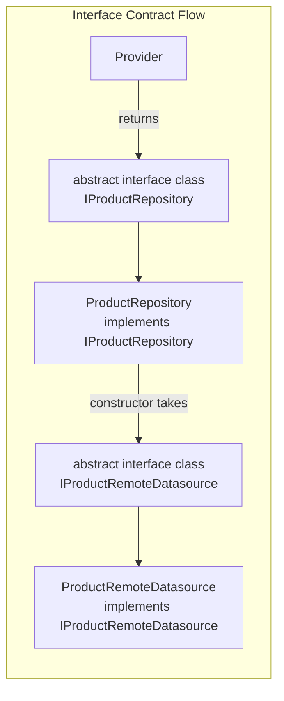

# Architecture

Flutter clean architecture with four layers. Dependencies flow inward: Presentation → Repository → Domain → Data.

## Rules — NEVER Violate

1. **MUST** create separate data models and domain entities — NEVER reuse one class for both.
2. **MUST** define `abstract interface class` for every repository and datasource. Constructors MUST accept interfaces, NEVER concrete types.
3. **MUST NEVER** put `fromJson`/`toJson` on domain entities — serialization belongs in the Data layer.
4. **MUST NEVER** import Flutter in the Domain layer — entities are pure Dart with zero dependencies.
5. **MUST** use `model.toEntity()` in repositories to map Data → Domain.
6. **NEVER** try-catch in datasources or domain — catch once in the repository or notifier.
7. **MUST** place feature-specific widgets in `features/x/presentation/widgets/` — shared widgets go in `core/widgets/`.



**Contents:** [Full Directory Structure](#full-directory-structure) | [Layer Responsibilities](#layer-responsibilities) | [Complexity Tiers](#complexity-tiers) | [Design Tokens](#design-tokens) | [Atomic Design for Widgets](#atomic-design-for-widgets)

For mixin vs interface vs extension guidance, see [mixins.md](mixins.md).

## Full Directory Structure

```
lib/
├── core/
│   ├── config/
│   │   └── app_config.dart              # Environment variables, API URLs
│   ├── domain/
│   │   └── errors/
│   │       └── app_error.dart           # Shared error types
│   ├── extensions/
│   │   ├── extensions.dart               # Barrel export for all extensions
│   │   ├── context_extensions.dart       # Theme, media, breakpoints, feedback
│   │   ├── string_extensions.dart        # capitalize, truncate, initials
│   │   ├── date_time_extensions.dart     # timeAgo, isToday, startOfDay
│   │   ├── iterable_extensions.dart      # firstWhereOrNull, groupBy
│   │   └── widget_extensions.dart        # separatedBy
│   ├── mixins/
│   │   └── connectivity_mixin.dart      # Cross-cutting behavior mixins
│   ├── navigation/
│   │   ├── routes.dart                  # Typed GoRouter route classes
│   │   ├── routes.g.dart
│   │   └── router_provider.dart         # GoRouter provider with auth redirect
│   ├── services/
│   │   ├── http_service.dart            # HTTP client wrapper
│   │   ├── storage_service.dart         # Local persistence
│   │   └── database_service.dart
│   ├── theme/
│   │   ├── app_colors.dart
│   │   ├── spacing.dart                 # Spacing constants
│   │   ├── radii.dart                   # BorderRadius constants
│   │   └── icon_sizes.dart
│   ├── utils/
│   │   ├── batch_utils.dart             # Parallel batch processing
│   │   ├── debouncer.dart               # Timer-based debouncer
│   │   ├── snack_bar_utils.dart         # Centralized SnackBarUtils (context-free)
│   │   ├── validators.dart              # Form validation functions
│   │   └── date_formatter.dart
│   └── widgets/
│       ├── atoms/                       # Buttons, badges, indicators
│       ├── molecules/                   # Avatar tiles, stat cards
│       ├── organisms/                   # Data grids, navigation headers
│       └── templates/                   # Dashboard layouts, list-detail
├── features/
│   ├── auth/
│   │   ├── data/
│   │   │   ├── datasources/
│   │   │   │   └── auth_remote_datasource.dart
│   │   │   └── models/
│   │   │       └── auth_model.dart
│   │   ├── domain/
│   │   │   └── entities/
│   │   │       └── user.dart
│   │   ├── repositories/
│   │   │   └── auth_repository.dart
│   │   └── presentation/
│   │       ├── notifiers/
│   │       │   └── auth_notifier.dart
│   │       ├── screens/
│   │       │   └── login_screen.dart
│   │       └── widgets/
│   │           └── login_form.dart
│   ├── products/
│   │   ├── data/
│   │   │   ├── datasources/
│   │   │   │   ├── product_remote_datasource.dart
│   │   │   │   └── product_local_datasource.dart
│   │   │   └── models/
│   │   │       └── product_model.dart
│   │   ├── domain/
│   │   │   └── entities/
│   │   │       └── product.dart
│   │   ├── repositories/
│   │   │   └── product_repository.dart
│   │   └── presentation/
│   │       ├── notifiers/
│   │       │   └── product_notifier.dart
│   │       ├── screens/
│   │       │   ├── product_list_screen.dart
│   │       │   └── product_detail_screen.dart
│   │       └── widgets/
│   │           ├── product_card.dart
│   │           └── product_filter.dart
│   └── home/
│       └── presentation/
│           ├── notifiers/
│           │   └── home_notifier.dart
│           ├── screens/
│           │   └── home_screen.dart
│           └── widgets/
│               └── home_section.dart
└── main.dart
```

## Layer Responsibilities

### Domain Layer

**MUST be pure Dart.** MUST NOT import Flutter or any package. Defines what the data looks like. Models MUST own behavior derived from their own fields (see [freezed-sealed.md](freezed-sealed.md#rich-models)).

```dart
// features/products/domain/entities/product.dart
@freezed
sealed class Product with _$Product {
  const Product._();

  const factory Product({
    required String id,
    required String name,
    required double price,
    @Default(0) int quantity,
    @Default(true) bool isActive,
  }) = _Product;

  double get totalValue => price * quantity;
  bool get inStock => quantity > 0;
}
```

Entities MUST NEVER contain `fromJson`/`toJson`. Serialization belongs in the Data layer.

### Data Layer

Models mirror entities but add serialization. Models MUST own their formatting: `toEntity()`, `toNameOnlyRequestBody()`, etc. MUST define `abstract interface class` for every datasource. Provider MUST return the interface type, NEVER the concrete class.

```dart
// features/products/data/models/product_model.dart
@freezed
sealed class ProductModel with _$ProductModel {
  const factory ProductModel({
    required String id,
    required String name,
    required double price,
    @Default(0) int quantity,
    @JsonKey(name: 'is_active') @Default(true) bool isActive,
  }) = _ProductModel;

  factory ProductModel.fromJson(Map<String, dynamic> json) =>
      _$ProductModelFromJson(json);

  const ProductModel._();

  /// Map to domain entity
  Product toEntity() => Product(
        id: id,
        name: name,
        price: price,
        quantity: quantity,
        isActive: isActive,
      );
  
  /// Map to API request body with only name (for example)
  Map<String, dynamic> toNameOnlyRequestBody() => {
        'id': id,
        'name': name
  }
}
```

```dart
// features/products/data/datasources/product_remote_datasource.dart

/// Interface contract — depend on this, not the concrete class
abstract interface class IProductRemoteDatasource {
  Future<List<ProductModel>> fetchAll();
  Future<ProductModel> fetchById(String id);
  Future<void> create(ProductModel model);
}

@Riverpod(keepAlive: true)
IProductRemoteDatasource productRemoteDatasource(Ref ref) {
  return ProductRemoteDatasource(ref.read(httpServiceProvider));
}

class ProductRemoteDatasource implements IProductRemoteDatasource {
  ProductRemoteDatasource(this._http);
  final HttpService _http;

  @override
  Future<List<ProductModel>> fetchAll() async {
    final response = await _http.get('/products');
    return (response as List)
        .map((json) => ProductModel.fromJson(json))
        .toList();
  }

  @override
  Future<ProductModel> fetchById(String id) async {
    final json = await _http.get('/products/$id');
    return ProductModel.fromJson(json);
  }

  @override
  Future<void> create(ProductModel model) async {
    await _http.post('/products', body: model.toJson());
  }
}
```

### Repository Layer

Bridges Data and Domain. Orchestrates datasources, maps models to entities. MUST define `abstract interface class`. Constructor MUST accept datasource interfaces, NEVER concrete types. Provider MUST return the interface type.

```dart
// features/products/repositories/product_repository.dart

/// Interface contract — notifiers depend on this, not the concrete class
abstract interface class IProductRepository {
  Future<List<Product>> fetchAll();
  Future<Product> fetchById(String id);
}

@Riverpod(keepAlive: true)
IProductRepository productRepository(Ref ref) {
  return ProductRepository(
    ref.read(productRemoteDatasourceProvider),
    ref.read(productLocalDatasourceProvider),
  );
}

class ProductRepository implements IProductRepository {
  ProductRepository(this._remote, this._local);
  final IProductRemoteDatasource _remote;
  final IProductLocalDatasource _local;

  @override
  Future<List<Product>> fetchAll() async {
    try {
      final models = await _remote.fetchAll();
      await _local.cacheAll(models);
      return models.map((m) => m.toEntity()).toList();
    } catch (_) {
      // Fallback to cache
      final cached = await _local.getAll();
      return cached.map((m) => m.toEntity()).toList();
    }
  }

  @override
  Future<Product> fetchById(String id) async {
    final model = await _remote.fetchById(id);
    return model.toEntity();
  }
}
```

NEVER try-catch in datasources or domain. Catch once in the repository or notifier.

### Presentation Layer

Notifiers manage state. Screens compose widgets. Widgets MUST watch providers directly — NEVER prop drill.

See [state-management.md](state-management.md) for full notifier patterns.

```dart
// features/products/presentation/notifiers/product_notifier.dart
@freezed
sealed class ProductState with _$ProductState {
  const factory ProductState({
    @Default([]) List<Product> items,
    @Default(false) bool isLoading,
    String? error,
  }) = _ProductState;
}

// Full notifier pattern in state-management.md
@Riverpod(keepAlive: true)
class ProductNotifier extends _$ProductNotifier {
  @override
  ProductState build() {
    _load();
    return const ProductState();
  }

  // ... see state-management.md for _load(), optimistic updates, etc.
}
```

```dart
// features/products/presentation/screens/product_list_screen.dart
class ProductListScreen extends ConsumerWidget {
  const ProductListScreen({super.key});

  @override
  Widget build(BuildContext context, WidgetRef ref) {
    final isLoading = ref.watch(
      productProvider.select((s) => s.isLoading),
    );

    if (isLoading) return const Center(child: CircularProgressIndicator());

    return const ProductListView();
  }
}

class ProductListView extends ConsumerWidget {
  const ProductListView({super.key});

  @override
  Widget build(BuildContext context, WidgetRef ref) {
    final items = ref.watch(
      productProvider.select((s) => s.items),
    );

    return ListView.builder(
      itemCount: items.length,
      itemBuilder: (context, index) => ProductCard(id: items[index].id),
    );
  }
}
```

## Complexity Tiers

| Tier | Data | Auth | Example | Implementation |
|------|------|------|---------|----------------|
| 1 | Simple, no PII | None | To-do lists, notes | Single repo, no datasources, Hive |
| 2 | Public data | Basic | Social, catalogs | Remote + local datasources, HTTP |
| 3 | PII, financial | Full | Banking, health | Full architecture, domain errors |

Start with Tier 2. Simplify to Tier 1 only for trivial apps. Use Tier 3 for regulated industries.

## Design Tokens

NEVER hardcode spacing, colors, radii, or icon sizes. See [atomic-design.md](atomic-design.md) for all token definitions (`Spacing`, `Radii`, `IconSizes`, typography, `ColorScheme`, semantic colors).

```dart
// Usage
Padding(padding: const EdgeInsets.all(Spacing.s16))
Text('Title', style: Theme.of(context).textTheme.titleMedium)
Container(color: Theme.of(context).colorScheme.primary)
```

## Atomic Design for Widgets

Shared widgets in `core/widgets/` follow atomic design: tokens → atoms → molecules → organisms → templates → pages. See [atomic-design.md](atomic-design.md) for full rules, code examples at each level, and placement guidelines.

Feature-specific widgets go in `features/x/presentation/widgets/`, not in `core/widgets/`.
