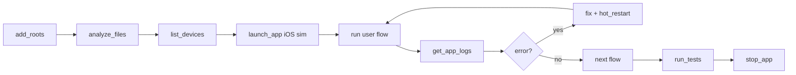

# Dart MCP E2E Testing

Dart MCP first. Shell fallback only.

https://docs.flutter.dev/ai/mcp-server

## Rules — NEVER Violate

1. MUST use Dart MCP tools before terminal commands.
2. MUST run on asked device class (iOS flow => iOS simulator).
3. MUST run test -> fail -> fix -> retest loop.
4. MUST capture logs after each major flow segment.
5. MUST stop app clean at end.

## Tool Map

| Goal | Tool |
|------|------|
| Set project roots | `mcp_dart_add_roots` |
| Analyze code | `mcp_dart_analyze_files` |
| Auto-fix analyzable issues | `mcp_dart_dart_fix` |
| Format Dart | `mcp_dart_dart_format` |
| List devices | `mcp_dart_list_devices` |
| Launch app | `mcp_dart_launch_app` |
| Run tests | `mcp_dart_run_tests` |
| Hot restart | `mcp_dart_hot_restart` |
| List running apps | `mcp_dart_list_running_apps` |
| Fetch app logs | `mcp_dart_get_app_logs` |
| Inspect widget tree | `mcp_dart_get_widget_tree` |
| Pick widget in app | `mcp_dart_set_widget_selection_mode` |
| Stop app | `mcp_dart_stop_app` |
| Remove roots | `mcp_dart_remove_roots` |

## Fast Path (E2E)

## End-to-End Loop

1. Add root once.
2. Analyze before launch. Fix clear issues first.
3. Pick iOS simulator from `mcp_dart_list_devices`.
4. Launch app on selected iOS sim.
5. Run one full user journey.
6. Pull logs. Check exceptions/assertions.
7. If fail: smallest fix, hot restart, rerun same journey.
8. If green: move next journey.
9. After all journeys, run tests.
10. Stop app.

## Journey Checklist Template

Copy this per feature.

- Entry route opens
- Primary CTA works
- Empty/loading/error states render
- Create/edit/delete path works
- Back nav works
- Persisted data survives reopen
- No new critical logs

## Failure Triage

- Assertion in logs: fix state/lifecycle first.
- Backend write fail: check datasource id contract, retry.
- Widget not tappable: inspect tree, add deterministic key, retest.
- Stale UI after save: check provider invalidation/sync path.

## Exit Criteria

1. All target journeys pass on device class asked.
2. No new critical log errors.
3. Tests pass after final fix pass.
4. App process stopped.
