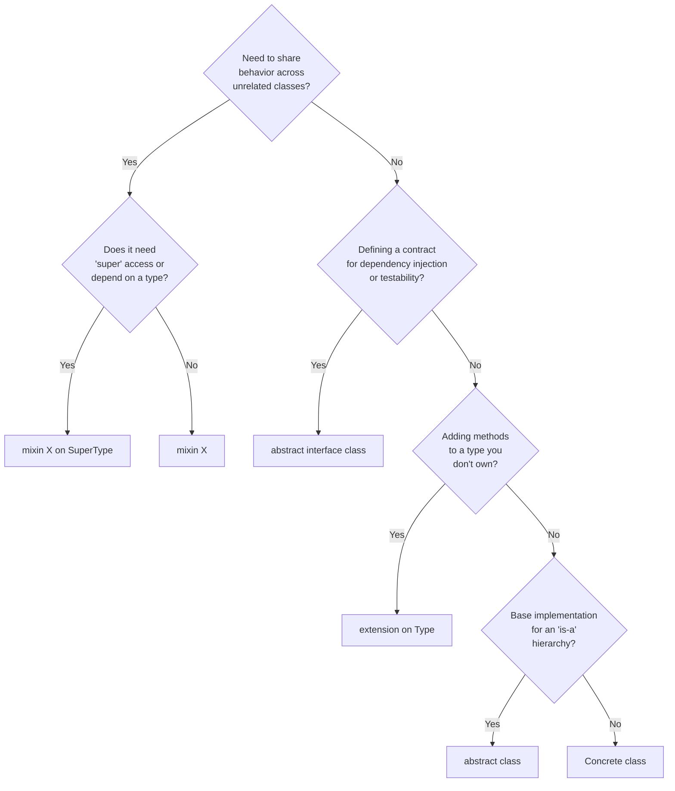

# Mixin vs Interface vs Extension

Pick right abstraction. Wrong pick → coupling, bloated hierarchies, dup code.

**Contents:** [Rules](#rules--never-violate) | [Decision Tree](#decision-tree) | [Quick Reference](#quick-reference) | [Common Flutter Mixins](#common-flutter-mixins) | [Custom Mixin Example](#custom-mixin-example) | [Restricted Mixin](#mixin-with-on-clause-restricted)

## Rules — NEVER Violate

1. **MUST** use `mixin` for reusable behavior across unrelated classes. NEVER inherit to share behavior without "is-a".
2. **MUST** use `abstract interface class` for contracts (what class must do). MUST use `mixin` for capabilities (what class can do).
3. **MUST** keep mixins small, focused — one capability per mixin (SRP).
4. **MUST** suffix mixin names with `Mixin` (e.g., `LoggingMixin`, `ConnectivityMixin`).
5. **MUST** use `on` clause when mixin needs `super` access or must restrict users (e.g., `mixin ShowcaseScreenMixin on ConsumerState`).
6. **MUST NEVER** put mutable state fields in mixins — hidden side effects across unrelated classes. Pass state via ctor or method args.
7. **MUST NEVER** use `mixin class` unless type needs both direct instantiation AND mixing in. Prefer pure `mixin`.
8. **MUST** use `extension` for adding methods to types you don't own (e.g., `String`, `BuildContext`). NEVER mixin for this.

## Decision Tree



## Quick Reference

| Tool | Keyword | Purpose | Multiple? | Constructors? |
|------|---------|---------|-----------|---------------|
| Mixin | `mixin` | Add capabilities ("can do") | Yes — `with A, B, C` | No |
| Interface | `abstract interface class` | Define contract ("must do") | Yes — `implements A, B` | Yes |
| Extension | `extension on Type` | Add methods to existing types | N/A | N/A |
| Abstract class | `abstract class` | Base impl ("is-a") | No — single `extends` | Yes |
| Mixin class | `mixin class` | Both class and mixin (rare) | One `with`, one `extends` | Limited |

## Common Flutter Mixins

| Mixin | `on` Constraint | Use Case |
|-------|----------------|----------|
| `SingleTickerProviderStateMixin` | `State` | One `AnimationController` — provides `vsync` |
| `TickerProviderStateMixin` | `State` | Multiple `AnimationController`s |
| `AutomaticKeepAliveClientMixin` | `State` | Keep tab/page alive in `PageView`/`TabBarView` |
| `WidgetsBindingObserver` | — | App lifecycle events (`didChangeAppLifecycleState`) |

## Custom Mixin Example

```dart
// core/mixins/connectivity_mixin.dart

/// Adds connectivity check capability to any notifier.
/// Keeps the mixin stateless — calls an injected service.
mixin ConnectivityMixin {
  bool checkConnectivity(ConnectivityService service) {
    return service.isConnected;
  }
}

// Usage in a notifier
class ProductNotifier extends _$ProductNotifier with ConnectivityMixin {
  @override
  ProductState build() {
    Future.microtask(_load); // Defer — see "Sync Notifier Initialization Trap"
    return const ProductState();
  }

  Future<void> _load() async {
    if (!ref.mounted) return;
    final connected = checkConnectivity(
      ref.read(connectivityServiceProvider),
    );
    if (!connected) {
      state = state.copyWith(error: 'No connection');
      return;
    }
    // ...fetch from remote
  }
}
```

## Mixin with `on` Clause (Restricted)

```dart
// core/mixins/showcase_screen_mixin.dart

/// Restricts this mixin to ConsumerState subclasses only.
mixin ShowcaseScreenMixin on ConsumerState {
  String get showcaseScope;
  List<GlobalKey> get showcaseKeys;

  void initShowcase() {
    // Can access 'ref' and 'widget' because of 'on ConsumerState'
  }

  void disposeShowcase() { /* cleanup */ }
}
```