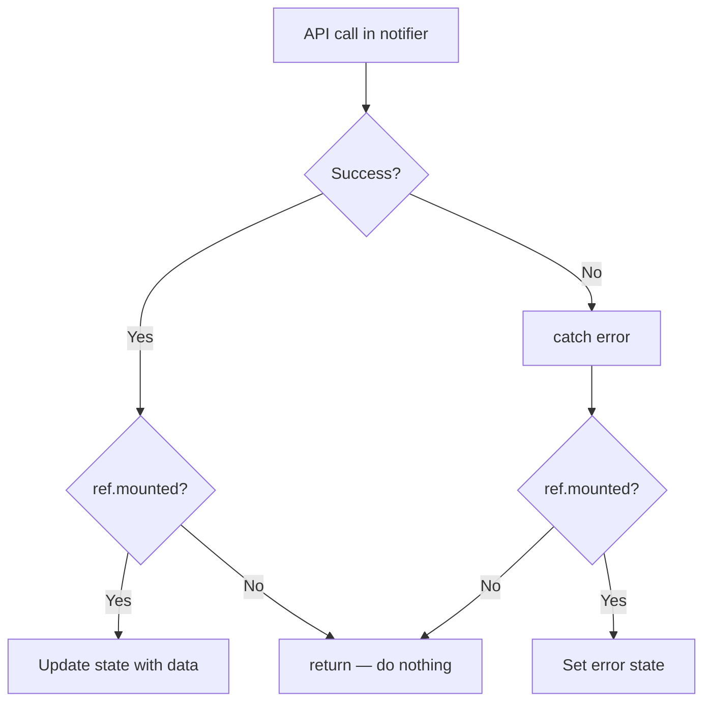

# State Management

Notifier patterns manage mutable state with Riverpod 3.x codegen.

## Rules — NEVER Violate

1. **MUST** check `if (!ref.mounted) return;` after EVERY `await` in notifiers.
2. **MUST** check `if (!context.mounted) return;` after EVERY `await` in widgets.
3. **MUST** catch errors in notifier by default. Datasources, repositories propagate. `try/catch` at data layer allowed **only** for: (a) domain error translation, (b) idempotency recovery (404/409), (c) transaction rollback, (d) local-first fire-and-forget sync. Plain log-and-rethrow forbidden — delete it.
4. **MUST** use `ref.read()` for one-time access in callbacks. MUST use `ref.watch()` to rebuild on dep change.
5. **MUST** dispose timers, controllers, subscriptions via `ref.onDispose()`.
6. **NEVER** use `ref.watch()` inside notifier method — use `ref.read()` or `ref.listen()`.
7. **NEVER** set state after mounted check fails — return immediately.
8. **NEVER** read `state` (incl `state.copyWith`) inside sync `Notifier.build()` or any path running sync before `build()` returns. First `state` assignment in sync notifier must be direct value (e.g. `state = const FooState(isLoading: true)`), or deferred via `Future.microtask`. Reading state before first `state=` throws *"Tried to read the state of an uninitialized provider"*. `AsyncNotifier` exempt (pre-initialized to `AsyncLoading`). See [Sync Notifier Initialization Trap](#sync-notifier-initialization-trap).
9. **MUST** init repositories/deps inside mutation methods before writes (`create*`, `update*`, `delete*`, `set*`, `reorder*`). Never rely only on background `_init*()` timing.
10. **MUST** avoid broad parent-provider invalidation in navigation-critical flows (wizard/deep-link route params). Prefer targeted notifier sync (`upsert`/replace/remove) to preserve route-entity continuity during rebuilds.



**Contents:** [Notifier Structure](#notifier-structure) | [Sync Notifier Initialization Trap](#sync-notifier-initialization-trap) | [ref.mounted Guard](#refmounted-guard) | [Dependency Readiness For Mutations](#dependency-readiness-for-mutations) | [Optimistic Updates](#optimistic-updates) | [Preventing Duplicate Fetches](#preventing-duplicate-fetches) | [Async Initialization](#async-initialization) | [AsyncNotifier Pattern](#asyncnotifier-pattern) | [AsyncValue.requireValue](#asyncvaluerequirevalue) | [Loading Progress](#loading-progress) | [Cleanup](#cleanup) | [Error Handling Strategy](#error-handling-strategy) | [Domain Error Types](#domain-error-types) | [Cross-Provider Communication](#cross-provider-communication)

## Notifier Structure

Every feature notifier follows same pattern:

```dart
part 'product_notifier.g.dart';

@freezed
sealed class ProductState with _$ProductState {
  const factory ProductState({
    @Default([]) List<Product> items,
    @Default(false) bool isLoading,
    String? error,
  }) = _ProductState;
}

@Riverpod(keepAlive: true)
class ProductNotifier extends _$ProductNotifier {
  @override
  ProductState build() {
    // Defer work — avoids reading uninitialized state during build.
    // See "Sync Notifier Initialization Trap".
    Future.microtask(_load);
    return const ProductState(isLoading: true);
  }

  Future<void> _load() async {
    if (!ref.mounted) return;
    try {
      final items = await ref.read(productRepositoryProvider).fetchAll();
      if (!ref.mounted) return;
      state = state.copyWith(items: items, isLoading: false);
    } catch (e) {
      if (!ref.mounted) return;
      state = state.copyWith(isLoading: false, error: e.toString());
    }
  }

  Future<void> refresh() async {
    state = state.copyWith(isLoading: true, error: null);
    await _load();
  }
}
```

Key points:
- Initial loading flag set via returned constant — never `state.copyWith` before `build()` returns.
- `_load()` dispatched through `Future.microtask`, so body runs after `build()` completes and state initialized.
- `refresh()` safe to use `state.copyWith` — runs after mount.

## Sync Notifier Initialization Trap

Sync `Notifier<T>` has **no initial state** until `build()` returns. Reading `state` before first `state=` throws:

> `Bad state: Tried to read the state of an uninitialized provider.`

(See `riverpod/src/core/provider/notifier_provider.dart` — `state` getter documents this.)

Dart `async` function body runs **synchronously up to first `await`**. So calling `_load()` from `build()` executes code before first `await` *before* `build()` returns. If that code reads `state` (incl `state.copyWith(...)`), throws.

`AsyncNotifier` exempt — Riverpod pre-initializes state to `AsyncLoading` before `build()` runs.

### ❌ Wrong — read before init

```dart
@Riverpod(keepAlive: true)
class ProductNotifier extends _$ProductNotifier {
  @override
  ProductState build() {
    _load();                       // body runs sync until first await
    return const ProductState();
  }

  Future<void> _load() async {
    state = state.copyWith(        // ❌ state not yet initialized — throws
      isLoading: true,
    );
    final items = await ref.read(productRepositoryProvider).fetchAll();
    // ...
  }
}
```

### ❌ Wrong — `fireImmediately: true` with sync state read

```dart
@override
FooState build() {
  ref.listen(authProvider, (prev, next) {
    state = state.copyWith(...);   // ❌ fires sync during build — throws
  }, fireImmediately: true);
  return const FooState();
}
```

### ✅ Right — direct-value seed + deferred load

```dart
@override
ProductState build() {
  Future.microtask(_load);                         // runs after build returns
  return const ProductState(isLoading: true);      // seed via constructor
}
```

### ✅ Right — set state before registering `fireImmediately` listener

```dart
@override
FooState build() {
  // A direct-value write primes state so later reads inside listeners are safe.
  state = const FooState();
  ref.listen(authProvider, (prev, next) {
    state = state.copyWith(...);                   // safe
  }, fireImmediately: true);
  return state;
}
```

### ✅ Right — drop `fireImmediately`, defer initial handling

```dart
@override
FooState build() {
  ref.listen(authProvider, _handleAuthChange);     // no fireImmediately
  Future.microtask(() {
    if (!ref.mounted) return;
    _handleAuthChange(null, ref.read(authProvider));
  });
  return const FooState();
}
```

Rule of thumb: **first `state =` in sync notifier must be direct value, not `copyWith`.**

## ref.mounted Guard

Riverpod 3.0 throws if you touch disposed Ref. MUST guard after EVERY `await`:

```dart
Future<void> save(Product product) async {
  state = state.copyWith(isLoading: true);

  await ref.read(productRepositoryProvider).save(product);
  if (!ref.mounted) return;  // REQUIRED

  state = state.copyWith(isLoading: false);

  await ref.read(productRepositoryProvider).refreshCache();
  if (!ref.mounted) return;  // REQUIRED after each await

  state = state.copyWith(items: await _fetchAll());
}
```

MUST guard after EVERY `await`, not just first.

## Dependency Readiness For Mutations

If notifier inits repositories async in `build()`/`_init()`, mutation methods can run before deps ready and silently no-op.

### ❌ Wrong — null repo short-circuit in user action

```dart
Future<void> saveThing(Thing thing) async {
  final repo = _repository;
  if (repo == null) return; // silently does nothing if init is racing
  await repo.save(thing);
}
```

### ✅ Right — ensure before write

```dart
Future<IThingRepository?> _ensureRepository() async {
  _repository ??= await ref.read(thingRepositoryProvider.future);
  if (!ref.mounted) return null;
  return _repository;
}

Future<void> saveThing(Thing thing) async {
  final repo = await _ensureRepository();
  if (repo == null) return;
  await repo.save(thing);
  if (!ref.mounted) return;
}
```

Rule of thumb: method mutates data → must call `ensure` helper first.

## Optimistic Updates

Update UI immediately. Revert on failure:

```dart
Future<void> deleteItem(String id) async {
  final previousItems = state.items;

  // Update UI immediately
  state = state.copyWith(
    items: state.items.where((i) => i.id != id).toList(),
  );

  try {
    await ref.read(productRepositoryProvider).delete(id);
  } catch (e) {
    if (!ref.mounted) return;
    // Revert on failure
    state = state.copyWith(
      items: previousItems,
      error: 'Delete failed',
    );
  }
}
```

## Preventing Duplicate Fetches

Guard against multiple simultaneous fetches:

```dart
@Riverpod(keepAlive: true)
class ProductNotifier extends _$ProductNotifier {
  bool _isFetching = false;

  @override
  ProductState build() {
    Future.microtask(_load);
    return const ProductState(isLoading: true);
  }

  Future<void> _load() async {
    if (_isFetching) return;
    _isFetching = true;

    // Safe: runs after build returns, so state is initialized.
    if (ref.mounted) state = state.copyWith(isLoading: true);
    try {
      final items = await ref.read(productRepositoryProvider).fetchAll();
      if (!ref.mounted) return;
      state = state.copyWith(items: items, isLoading: false);
    } catch (e) {
      if (!ref.mounted) return;
      state = state.copyWith(isLoading: false, error: e.toString());
    } finally {
      _isFetching = false;
    }
  }
}
```

## Async Initialization

Use build method for init. Riverpod calls `build()` when provider first read. For sync `Notifier`, **dispatch async init via `Future.microtask`** so nothing reads `state` before `build()` returns (see [Sync Notifier Initialization Trap](#sync-notifier-initialization-trap)):

```dart
@Riverpod(keepAlive: true)
class AuthNotifier extends _$AuthNotifier {
  @override
  AuthState build() {
    Future.microtask(_checkSession);
    return const AuthState.loading();
  }

  Future<void> _checkSession() async {
    try {
      final user = await ref.read(authRepositoryProvider).getSession();
      if (!ref.mounted) return;
      state = AuthState.authenticated(user);
    } catch (_) {
      if (!ref.mounted) return;
      state = const AuthState.unauthenticated();
    }
  }
}
```

## AsyncNotifier Pattern

For providers exposing `AsyncValue` directly:

```dart
@Riverpod(keepAlive: true)
class UserNotifier extends _$UserNotifier {
  @override
  Future<User> build() async {
    final repo = ref.read(userRepositoryProvider);
    return repo.getCurrentUser();
  }

  /// Refresh data
  Future<void> refresh() async {
    state = const AsyncLoading<User>();
    state = await AsyncValue.guard(() async {
      final repo = ref.read(userRepositoryProvider);
      return repo.getCurrentUser();
    });
  }

  Future<void> updateName(String name) async {
    state = const AsyncLoading();
    state = await AsyncValue.guard(() async {
      final repo = ref.read(userRepositoryProvider);
      return repo.updateName(name);
    });
  }
}

// Widget usage
class UserProfile extends ConsumerWidget {
  @override
  Widget build(BuildContext context, WidgetRef ref) {
    final userAsync = ref.watch(userProvider);
    return switch (userAsync) {
      AsyncData(:final value) => Text(value.name),
      AsyncError(:final error) => ErrorRetry(
        message: error.toString(),
        onRetry: () => ref.invalidate(userProvider),
      ),
      AsyncLoading() => const ShimmerPlaceholder(), // Prefer shimmer over bare spinner
    };
  }
}
```

**Key:** `AsyncValue.guard` wraps try-catch, assigns `AsyncData` or `AsyncError` atomically. No explicit `ref.mounted` check needed — guard handles state assignment in one step. Avoid `copyWithPrevious`; internal in Riverpod 3 dev builds.

## AsyncValue.requireValue

Combine multiple async providers sync when you know loaded:

```dart
@Riverpod(keepAlive: true)
class DashboardNotifier extends _$DashboardNotifier {
  @override
  Future<DashboardData> build() async {
    // Both providers load in parallel
    final user = ref.watch(userProvider).requireValue;
    final products = ref.watch(productProvider).requireValue;

    return DashboardData(user: user, products: products);
  }
}
```

Use `requireValue` only when certain provider has data. Throws if loading or error state.

## Loading Progress

Report loading progress with `AsyncLoading.progress`:

```dart
@override
Future<List<Product>> build() async {
  state = const AsyncLoading(progress: 0.0);
  final page1 = await fetchPage(1);

  state = const AsyncLoading(progress: 0.5);
  final page2 = await fetchPage(2);

  return [...page1, ...page2];
}
```

## Cleanup

Dispose timers, controllers, subscriptions:

```dart
@Riverpod(keepAlive: true)
class SearchNotifier extends _$SearchNotifier {
  Timer? _debounceTimer;

  @override
  SearchState build() {
    ref.onDispose(() => _debounceTimer?.cancel());
    return const SearchState();
  }
}
```

Lifecycle listeners now return unsubscribe functions:

```dart
final removeDispose = ref.onDispose(() => cleanup());
// Later, remove the listener if needed:
removeDispose();
```

## Error Handling Strategy

Default: catch errors once — in notifier. Datasources, repositories propagate.

```dart
// Datasource — default: propagate
Future<List<ProductModel>> fetchAll() => _http.get('/products');

// Repository — default: propagate
Future<List<Product>> fetchAll() async {
  final models = await _remote.fetchAll();
  return models.map((m) => m.toEntity()).toList();
}
```

### Legitimate `try/catch` in data layer

Default rule has four narrow exceptions. Each MUST have reason beyond "log and rethrow":

1. **Domain error translation** — map raw SDK exception to typed domain error so notifier matches on sealed types.
2. **Idempotency recovery** — swallow "already exists" / "not found" on operation whose contract is idempotent (e.g. 404 on delete in batch).
3. **Transaction rollback** — catch, run compensating writes, rethrow.
4. **Local-first fire-and-forget sync** — remote mirror of local write where caller intentionally doesn't await remote. Swallow + log so dead backend doesn't break local path.

❌ WRONG — bare `try { … } catch (e) { log(...); rethrow; }` adds nothing. Delete it; let notifier catch.

```dart
// ❌ pointless
Future<void> remove(String id) async {
  try {
    await _remote.remove(id);
  } on Exception catch (e, s) {
    Crash.error(e, s, reason: 'remove');
    rethrow;
  }
}

// ✅ propagate
Future<void> remove(String id) => _remote.remove(id);
```

```dart
// Notifier — MUST catch here
Future<void> _load() async {
  try {
    final items = await ref.read(productRepositoryProvider).fetchAll();
    if (!ref.mounted) return;
    state = state.copyWith(items: items);
  } catch (e) {
    if (!ref.mounted) return;
    state = state.copyWith(error: e.toString());
  }
}
```

### Domain Error Types

Define sealed error hierarchy for typed error handling in notifiers:

```dart
// core/domain/app_error.dart
@freezed
sealed class AppError with _$AppError {
  const factory AppError.network(String message) = NetworkError;
  const factory AppError.validation(String field, String message) = ValidationError;
  const factory AppError.notFound(String resource) = NotFoundError;
  const factory AppError.unauthorized() = UnauthorizedError;
  const factory AppError.unexpected(Object error) = UnexpectedError;
}
```

Use in notifier state, pattern-match in UI:

```dart
// State holds typed error instead of raw string
@freezed
sealed class ProductState with _$ProductState {
  const factory ProductState({
    @Default([]) List<Product> items,
    @Default(false) bool isLoading,
    AppError? error,
  }) = _ProductState;
}

// UI pattern-matches for user-friendly display
if (state.error case NetworkError(:final message))
  ErrorBanner(message: message, onRetry: () => ref.read(productProvider.notifier).refresh())
else if (state.error case NotFoundError(:final resource))
  Text('$resource not found')
```

## Cross-Provider Communication

Read other providers through `ref`:

```dart
@Riverpod(keepAlive: true)
class OrderNotifier extends _$OrderNotifier {
  @override
  OrderState build() => const OrderState();

  Future<void> placeOrder() async {
    final cart = ref.read(cartProvider);
    final user = ref.read(authProvider);

    if (user case Authenticated(:final user)) {
      await ref.read(orderRepositoryProvider).create(
        userId: user.id,
        items: cart.items,
      );
      if (!ref.mounted) return;

      // Reset cart after order
      ref.read(cartProvider.notifier).clear();
    }
  }
}
```

Use `ref.read` for one-time access. Use `ref.watch` to rebuild on dep change. Use `ref.listen` for side effects. NEVER use `ref.watch()` inside notifier method.